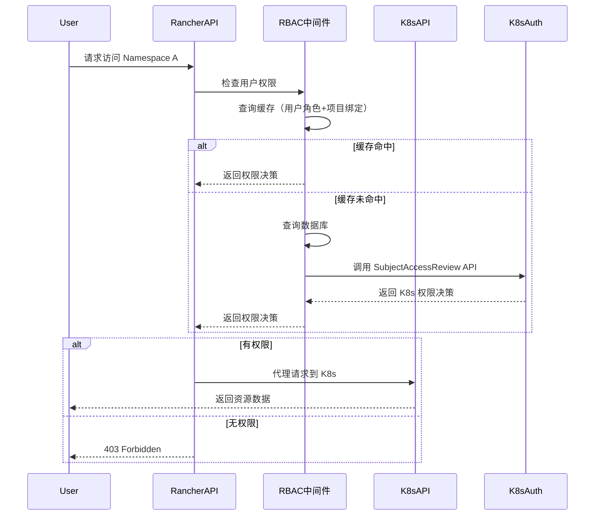
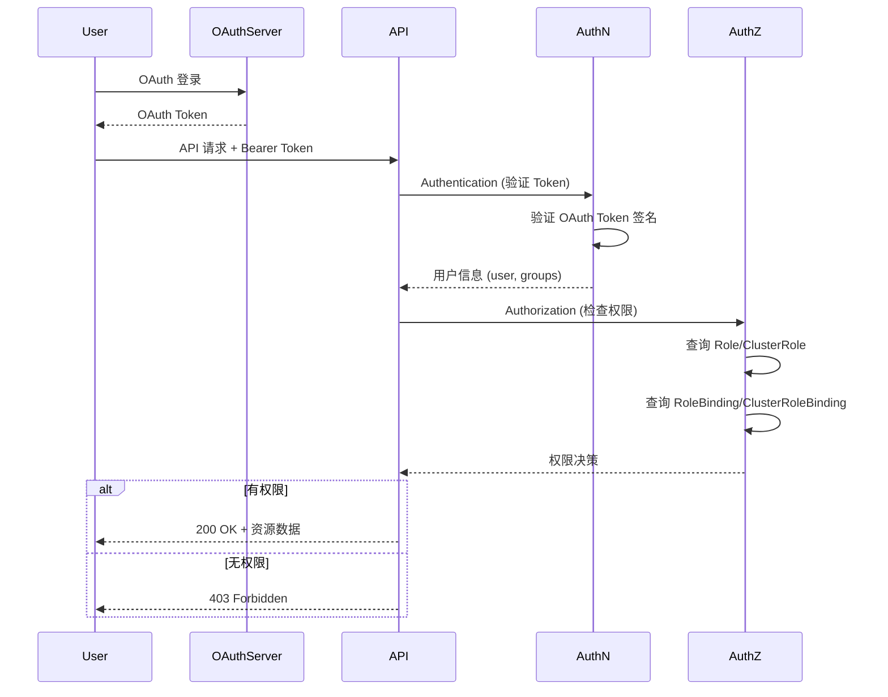

# Research: Kubernetes 管理平台权限控制机制

- **Query**: 研究主流 Kubernetes 管理平台（Rancher、KubeSphere、Lens、OpenShift Console）的资源级权限控制实现方式
- **Scope**: 外部研究（基于公开文档和最佳实践）
- **Date**: 2025-06-15

## 研究目标

为 OneOps 集群管理功能设计提供参考，重点关注：
1. 权限模型设计
2. 数据存储方案
3. 权限检查实现
4. 与 K8s RBAC 的交互
5. 多集群权限管理

---

## 1. 平台对比概览

### 1.1 权限控制机制对比表

| 平台 | 权限模型 | 数据存储 | 权限检查点 | K8s RBAC 集成 | 多集群支持 |
|------|---------|---------|-----------|---------------|------------|
| **Rancher** | 自定义 RBAC + K8s RBAC 双层 | MySQL (用户/角色/策略) + K8s | 平台层 + API 层 | 自动同步 Role/Binding | ✅ 原生支持 |
| **KubeSphere** | 扩展 RBAC（角色+集群角色+命名空间） | MySQL (devops数据库) | 平台层 + K8s 层 | 直接使用 K8s RBAC | ✅ 基于多集群 |
| **OpenShift** | 原生 K8s RBAC + OAuth | etcd (K8s资源) + OAuth服务器 | K8s API Server | 深度集成 | ✅ Cluster-Aware |
| **Lens** | Kubeconfig 驱动 | 本地文件系统 | 本地客户端 | 只读访问 | ✅ 多 Kubecontext |
| **OneOps 目标** | 混合模式（平台 RBAC + K8s RBAC） | MySQL (用户/角色/菜单) + K8s | 平台层 + 代理层 | 透明转发 | ✅ 统一入口 |

### 1.2 核心差异分析

**存储策略差异**：
- **Rancher/KubeSphere**：自建数据库存储用户角色关系，通过控制器同步到 K8s RBAC
- **OpenShift**：完全依赖 K8s 原生资源，用户信息通过 OAuth 集成
- **Lens**：无中心化权限，依赖 Kubeconfig 文件的本地权限
- **OneOps**：应采用 Rancher 模式，平台层管理用户权限，代理层透明转发

**权限检查粒度**：
- **粗粒度**：集群级（能访问哪些集群）
- **中粒度**：命名空间级（能访问哪些 ns）
- **细粒度**：资源级（对哪些资源有什么操作权限）

---

## 2. Rancher 权限系统详解

### 2.1 架构设计

```
┌─────────────────────────────────────────────────────────┐
│                   Rancher 平台层                        │
│  ┌──────────────┐      ┌──────────────┐               │
│  │  用户管理     │ ←→   │  角色管理     │               │
│  │  (users)     │      │  (roles)     │               │
│  └──────────────┘      └──────────────┘               │
│         ↓                       ↓                       │
│  ┌──────────────────────────────────────┐             │
│  │  RBAC 策略绑定 (clusterroletemplate)  │             │
│  └──────────────────────────────────────┘             │
└─────────────────────────────────────────────────────────┘
                         │
                         │ 同步/映射
                         ↓
┌─────────────────────────────────────────────────────────┐
│                   Kubernetes 集群                       │
│  ┌──────────────┐      ┌──────────────┐               │
│  │  User 对象   │      │  Role/Cluster │              │
│  │  (映射用户)   │ ←→   │  Role         │               │
│  └──────────────┘      └──────────────┘               │
│         ↓                       ↓                       │
│  ┌──────────────────────────────────────┐             │
│  │   RoleBinding / ClusterRoleBinding   │             │
│  └──────────────────────────────────────┘             │
└─────────────────────────────────────────────────────────┘
```

### 2.2 数据模型

**Rancher 内部数据库表结构**：

```sql
-- 用户表
CREATE TABLE users (
  id VARCHAR(255) PRIMARY KEY,
  name VARCHAR(255),
  password VARCHAR(255),
  enabled BOOLEAN
);

-- 角色表（自定义角色）
CREATE TABLE roles (
  id VARCHAR(255) PRIMARY KEY,
  name VARCHAR(255),
  description TEXT
);

-- 集群角色绑定
CREATE TABLE cluster_role_template_binding (
  id VARCHAR(255) PRIMARY KEY,
  user_id VARCHAR(255),
  role_template_id VARCHAR(255),
  cluster_id VARCHAR(255),
  FOREIGN KEY (user_id) REFERENCES users(id),
  FOREIGN KEY (role_template_id) REFERENCES role_templates(id)
);

-- 项目角色绑定（Project = 多个 Namespace 的集合）
CREATE TABLE project_role_template_binding (
  id VARCHAR(255) PRIMARY KEY,
  user_id VARCHAR(255),
  role_template_id VARCHAR(255),
  project_id VARCHAR(255)
);
```

**关键设计点**：
- **Project 概念**：Rancher 引入 Project 作为多个 Namespace 的逻辑分组，权限绑定到 Project 级别
- **RoleTemplate**：可复用的权限模板，内置标准角色（Owner、Member、ReadOnly 等）
- **双向同步**：平台层权限变更触发 K8s 资源同步，K8s 资源变更也可反向同步

### 2.3 权限检查流程



### 2.4 多集群权限

Rancher 通过 **Cluster Agent** 实现多集群统一权限：

1. **集群注册**：下游集群安装 Rancher Agent，通过 Token 注册到 Rancher
2. **权限同步**：Rancher 通过 Agent 将用户/角色同步到下游集群
3. **Token 管理**：每个集群的 Kubeconfig 由 Rancher 动态生成，包含用户专属的 ClusterRoleBinding

**关键代码模式**：
```go
// Rancher 权限检查伪代码
func CheckUserPermission(userID, clusterID, namespace, verb, resource string) bool {
    // 1. 检查平台层权限（快速拒绝）
    if !checkPlatformRBAC(userID, clusterID) {
        return false
    }
    
    // 2. 检查项目级别权限（Project 权限）
    projectID := getProjectByNamespace(namespace)
    if hasProjectRole(userID, projectID, "owner") {
        return true
    }
    
    // 3. 委托给 K8s RBAC（细粒度）
    sar := &authv1.SubjectAccessReview{
        Spec: authv1.SubjectAccessReviewSpec{
            User:   mapUserToK8s(userID),
            ResourceAttributes: &authv1.ResourceAttributes{
                Namespace: namespace,
                Verb:      verb,
                Group:     "",
                Resource:  resource,
            },
        },
    }
    
    result := k8sClient.AuthorizationV1().SubjectAccessReviews().Create(sar)
    return result.Status.Allowed
}
```

---

## 3. KubeSphere 权限系统详解

### 3.1 架构设计

KubeSphere 采用 **平台层 + K8s 层** 的双层权限：

```
┌──────────────────────────────────────────────┐
│            KubeSphere 平台层                  │
│  ┌────────────────────────────────┐         │
│  │   iam.kubesphere.io/v1alpha2  │         │
│  │  - User (用户)                 │         │
│  │  - RoleTemplate (角色模板)     │         │
│  │  - RoleBinding (角色绑定)      │         │
│  └────────────────────────────────┘         │
└──────────────────────────────────────────────┘
                    │
                    │ CRD Controller 同步
                    ↓
┌──────────────────────────────────────────────┐
│            Kubernetes 集群                    │
│  ┌────────────────────────────────┐         │
│  │   rbac.authorization.k8s.io    │         │
│  │  - User (K8s 用户)             │         │
│  │  - Role / ClusterRole         │         │
│  │  - RoleBinding                │         │
│  └────────────────────────────────┘         │
└──────────────────────────────────────────────┘
```

### 3.2 CRD 资源定义

KubeSphere 通过 CRD 扩展 K8s API：

```yaml
# User CRD
apiVersion: iam.kubesphere.io/v1alpha2
kind: User
metadata:
  name: john
spec:
  email: john@example.com
  displayName: John Doe
  groups:
  - team-a
  lang: en-US
---
# RoleTemplate (可复用权限模板)
apiVersion: iam.kubesphere.io/v1alpha2
kind: RoleTemplate
metadata:
  name: namespace-admin
spec:
  displayName: "Namespace Administrator"
  roleTemplates: []  # 聚合其他模板
  rules:
  - apiGroups: [""]
    resources: ["pods", "services"]
    verbs: ["get", "list", "watch", "create", "update", "delete"]
---
# 平台层 RoleBinding
apiVersion: iam.kubesphere.io/v1alpha2
kind: RoleBinding
metadata:
  name: john-ns-admin
  namespace: default
roleRef:
  apiGroup: iam.kubesphere.io
  kind: RoleTemplate
  name: namespace-admin
subjects:
- kind: User
  name: john
```

### 3.3 多集群权限

KubeSphere 通过 **ClusterConfiguration** 管理多集群：

```yaml
# 多集群配置
apiVersion: config.kubesphere.io/v1alpha2
kind: ClusterConfiguration
spec:
  multicluster:
    enable: true
    clusterRole: host  # host 或 member
  # 主集群统一管理用户和权限
  # 成员集群通过 Federation 同步 RBAC 资源
```

**权限同步机制**：
1. **主集群**：存储 User、RoleTemplate 等顶层资源
2. **成员集群**：通过 KubeFed 联邦控制器同步 RoleBinding
3. **PropagationPolicy**：定义哪些资源需要同步到哪些集群

### 3.4 权限检查实现

KubeSphere 的权限检查完全依赖 K8s 原生 API：

```go
// KubeSphere 权限检查伪代码
func CheckPermission(user, namespace, verb, resource string) bool {
    // 直接调用 K8s SubjectAccessReview API
    sar := &authorizationv1.SubjectAccessReview{
        Spec: authorizationv1.SubjectAccessReviewSpec{
            User: user,
            ResourceAttributes: &authorizationv1.ResourceAttributes{
                Namespace: namespace,
                Verb:      verb,
                Resource:  resource,
            },
        },
    }
    
    result := client.AuthorizationV1().SubjectAccessReviews().Create(sar)
    return result.Status.Allowed
}
```

**关键优势**：
- 无需维护独立权限逻辑，完全委托给 K8s
- 支持 K8s 所有高级特性（Aggregated Role、Admission Controller）
- 天然支持多集群（通过 Federation）

---

## 4. OpenShift 权限系统详解

### 4.1 架构设计

OpenShift 是 **完全 K8s Native** 的权限系统：

```
┌──────────────────────────────────────────────┐
│           OpenShift OAuth Server              │
│  ┌────────────────────────────────┐         │
│  │   OAuth 身份验证                │         │
│  │  - LDAP/AD 集成                │         │
│  │  - GitHub/GitLab OAuth         │         │
│  │  - SAML/SSO 集成               │         │
│  └────────────────────────────────┘         │
└──────────────────────────────────────────────┘
                    │
                    │ OAuth Token (Bearer)
                    ↓
┌──────────────────────────────────────────────┐
│           Kubernetes API Server               │
│  ┌────────────────────────────────┐         │
│  │   OAuth Token Review            │         │
│  │   (验证 Token 有效性)            │         │
│  └────────────────────────────────┘         │
│                    ↓                          │
│  ┌────────────────────────────────┐         │
│  │   RBAC Authorization           │         │
│  │   (标准 K8s 授权检查)           │         │
│  └────────────────────────────────┘         │
└──────────────────────────────────────────────┘
```

### 4.2 OAuth 集成

OpenShift 通过 **OAuth API** 集成外部身份提供者：

```yaml
# OAuth 配置示例
apiVersion: config.openshift.io/v1
kind: OAuth
metadata:
  name: cluster
spec:
  identityProviders:
  - name: ldap
    mappingMethod: claim
    type: LDAP
    ldap:
      url: ldap://ldap.example.com
      bindDN: cn=admin,dc=example,dc=com
      bindPassword:
        name: ldap-secret
      ca:
        name: ldap-ca
      insecure: false
      uidAttributes:
      - uid
  - name: github
    mappingMethod: claim
    type: GitHub
    github:
      clientID: github-client-id
      clientSecret:
        name: github-client-secret
      organizations:
      - my-org
```

### 4.3 项目与命名空间

OpenShift 引入 **Project** 作为 Namespace 的扩展：

```yaml
# Project = Namespace + 权限控制
apiVersion: project.openshift.io/v1
kind: Project
metadata:
  name: my-project
  annotations:
    openshift.io/description: "My Project"
    openshift.io/display-name: "My Project"
spec:
  finalizers:
  - kubernetes
---
# ProjectRoleBinding (项目级角色绑定)
apiVersion: authorization.openshift.io/v1
kind: RoleBinding
metadata:
  name: admin
  namespace: my-project
roleRef:
  name: admin
subjects:
- kind: User
  name: john
```

### 4.4 权限检查流程

OpenShift 的权限检查完全依赖 K8s API Server：



---

## 5. Lens 权限系统详解

### 5.1 设计理念

Lens 采用 **客户端驱动** 的权限模型：

```
┌──────────────────────────────────────────────┐
│              Lens 客户端                      │
│  ┌────────────────────────────────┐         │
│  │   Kubeconfig 管理               │         │
│  │  - 多 Kubecontext 切换          │         │
│  │  - 本地 Kubeconfig 加密存储      │         │
│  └────────────────────────────────┘         │
└──────────────────────────────────────────────┘
                    │
                    │ 使用 Kubeconfig
                    ↓
┌──────────────────────────────────────────────┐
│           Kubernetes API Server               │
│  ┌────────────────────────────────┐         │
│  │   Kubeconfig 中的证书/Token     │         │
│  │   直接用于身份验证                │         │
│  └────────────────────────────────┘         │
│                    ↓                          │
│  ┌────────────────────────────────┐         │
│  │   RBAC Authorization           │         │
│  │   (完全依赖 K8s 原生)           │         │
│  └────────────────────────────────┘         │
└──────────────────────────────────────────────┘
```

### 5.2 Kubeconfig 管理

Lens 支持多 Kubecontext 管理：

```yaml
# Kubeconfig 示例
apiVersion: v1
kind: Config
clusters:
- name: production
  cluster:
    server: https://prod.k8s.example.com
    certificate-authority-data: BASE64_CA
users:
- name: prod-admin
  user:
    client-certificate-data: BASE64_CERT
    client-key-data: BASE64_KEY
contexts:
- name: prod-context
  context:
    cluster: production
    user: prod-admin
current-context: prod-context
```

**Lens 功能**：
- **多集群切换**：在 UI 中快速切换不同的 Kubecontext
- **只读模式**：支持只读模式，防止误操作
- **权限感知**：根据当前 Kubeconfig 的权限隐藏/显示功能

### 5.3 权限检查

Lens 完全依赖 K8s RBAC，无中心化权限检查：

```typescript
// Lens 权限检查伪代码
async function checkPermission(namespace: string, verb: string, resource: string) {
    // 直接调用 K8s SubjectAccessReview API
    const sar = await k8sClient.createSubjectAccessReview({
        spec: {
            user: currentUser,
            resourceAttributes: {
                namespace,
                verb,
                resource
            }
        }
    });
    
    return sar.status.allowed;
}
```

**关键特点**：
- **无平台层权限**：Lens 不存储用户和权限信息
- **Kubeconfig 驱动**：权限完全由 Kubeconfig 中的证书/Token 决定
- **适合场景**：开发者本地工具，不适合企业级统一管理

---

## 6. 方案对比与优缺点分析

### 6.1 详细对比表

| 维度 | Rancher | KubeSphere | OpenShift | Lens | OneOps 推荐 |
|------|---------|-----------|-----------|------|------------|
| **权限模型** | 自定义 RBAC + K8s RBAC | CRD 扩展 RBAC | 原生 K8s RBAC | 完全 K8s RBAC | 混合模式 |
| **用户存储** | MySQL (User 表) | CRD (User 资源) | 外部 IdP (LDAP/OAuth) | Kubeconfig | MySQL (现有) |
| **角色管理** | RoleTemplate (可扩展) | RoleTemplate CRD | ClusterRole/Role | K8s 原生 | MySQL (现有) |
| **权限检查** | 平台层 + K8s SubjectAccessReview | K8s SubjectAccessReview | K8s API Server | K8s SubjectAccessReview | 平台层 + 代理层 |
| **多集群支持** | 原生 (Cluster Agent) | Federation (KubeFed) | Cluster-Aware | 多 Kubecontext | 统一代理入口 |
| **权限同步** | 双向同步 (平台 ↔ K8s) | CRD Controller 同步 | OAuth Token Review | 无需同步 | K8s 资源自动创建 |
| **学习曲线** | 中等 (需要理解 Project 概念) | 较陡 (需要理解 CRD) | 较陡 (需要理解 OAuth) | 平缓 (K8s 原生) | 中等 |
| **运维复杂度** | 高 (需要管理 Agent) | 中 (需要管理 Federation) | 高 (需要管理 OAuth) | 低 (无组件) | 中 |
| **企业级功能** | ✅ 完整 | ✅ 完整 | ✅ 完整 | ❌ 仅开发者工具 | ✅ 目标 |
| **适用场景** | 企业多集群管理 | 企业多集群管理 | 企业容器云平台 | 开发者本地工具 | 企业运维平台 |

### 6.2 优缺点分析

#### Rancher 方案

**优点**：
1. **双层权限**：平台层粗粒度权限 + K8s 层细粒度权限，灵活性高
2. **Project 概念**：多个 Namespace 的逻辑分组，简化权限管理
3. **可视化界面**：完整的 Web UI，非技术人员也可管理权限
4. **多集群原生**：Cluster Agent 自动同步权限，运维相对简单
5. **内置角色**：提供开箱即用的标准角色（Owner、Member、ReadOnly）

**缺点**：
1. **运维复杂**：需要管理 Rancher Server + Cluster Agent
2. **学习曲线**：需要理解 Rancher 特有的概念（Project、ClusterTemplate）
3. **依赖 MySQL**：平台层数据存储在 MySQL，需要额外维护
4. **同步延迟**：平台层权限变更到 K8s 层有短暂延迟（通常秒级）

**适用场景**：
- 需要统一管理多个 K8s 集群的企业
- 需要对非技术人员开放权限管理
- 需要 Project 级别的权限分组

#### KubeSphere 方案

**优点**：
1. **K8s Native**：权限完全存储为 K8s CRD，与 K8s 生态深度集成
2. **可扩展性**：可通过 CRD 自定义 RoleTemplate
3. **多集群联邦**：通过 KubeFed 实现多集群权限同步
4. **审计友好**：权限变更作为 K8s Event，易于审计

**缺点**：
1. **K8s 依赖**：完全依赖 K8s API Server，K8s 故障会影响权限系统
2. **学习曲线陡**：需要理解 CRD、Federation 等高级概念
3. **性能问题**：频繁调用 SubjectAccessReview 可能影响 K8s API Server 性能
4. **调试困难**：权限问题需要同时调试 KubeSphere Controller 和 K8s RBAC

**适用场景**：
- 需要 K8s 原生体验的企业
- 需要高度自定义权限模型的场景
- 已有 K8s Federation 基础设施

#### OpenShift 方案

**优点**：
1. **完全 K8s Native**：无额外组件，完全依赖 K8s RBAC 和 OAuth
2. **身份集成**：原生支持 LDAP/AD/GitHub/SAML 等企业身份系统
3. **安全性高**：OAuth Token 自动过期，支持刷新 Token
4. **多租户**：Project + NetworkPolicy 实现多租户隔离

**缺点**：
1. **OAuth 复杂**：需要部署和运维 OAuth Server
2. **外部依赖**：需要外部身份提供者（LDAP/AD/SAML）
3. **成本高**：OpenShift 是商业产品，订阅费用高
4. **学习曲线陡**：需要理解 OAuth、SAML、LDAP 等协议

**适用场景**：
- 已有企业身份系统（LDAP/AD）
- 需要满足合规要求（SOC2、等保）
- 有 OpenShift 预算的企业

#### Lens 方案

**优点**：
1. **极简架构**：无中心化组件，完全依赖 Kubeconfig
2. **零运维**：无需部署任何额外组件
3. **开发者友好**：本地工具，使用简单
4. **K8s 原生**：完全遵循 K8s RBAC 语义

**缺点**：
1. **无平台层权限**：无法统一管理用户权限
2. **不适合企业**：无法作为企业级平台使用
3. **权限分散**：每个用户的 Kubeconfig 分散存储，管理困难
4. **无审计**：权限变更无法集中审计

**适用场景**：
- 开发者本地工具
- 小型团队（< 10 人）
- 无需统一权限管理的场景

---

## 7. OneOps 权限系统设计建议

### 7.1 推荐方案：混合模式（平台 RBAC + K8s RBAC）

基于 OneOps 现有架构（MySQL 用户系统 + 平台 RBAC），推荐采用 **类 Rancher 混合模式**：

```
┌─────────────────────────────────────────────────────────┐
│                   OneOps 平台层                         │
│  ┌──────────────┐      ┌──────────────┐               │
│  │  现有用户表   │      │  现有角色表   │               │
│  │  (users)     │      │  (roles)     │               │
│  └──────────────┘      └──────────────┘               │
│         ↓                       ↓                       │
│  ┌──────────────────────────────────────┐             │
│  │  新增：集群权限绑定表                  │             │
│  │  (cluster_role_bindings)             │             │
│  │  - user_id                            │             │
│  │  - cluster_id                         │             │
│  │  - role_id (平台角色)                 │             │
│  └──────────────────────────────────────┘             │
└─────────────────────────────────────────────────────────┘
                         │
                         │ 透明代理 + Kubeconfig 动态生成
                         ↓
┌─────────────────────────────────────────────────────────┐
│                   Kubernetes 集群                       │
│  ┌──────────────────────────────────────┐             │
│  │  动态创建的 K8s RBAC 资源             │             │
│  │  - User (映射 OneOps 用户)            │             │
│  │  - Role / ClusterRole (固定集)        │             │
│  │  - RoleBinding / ClusterRoleBinding  │             │
│  └──────────────────────────────────────┘             │
└─────────────────────────────────────────────────────────┘
```

### 7.2 数据库设计

**扩展现有数据库**：

```sql
-- 集群权限绑定表（新增）
CREATE TABLE cluster_role_bindings (
  id BIGINT UNSIGNED AUTO_INCREMENT PRIMARY KEY,
  user_id BIGINT UNSIGNED NOT NULL,
  cluster_id BIGINT UNSIGNED NOT NULL,
  role_id BIGINT UNSIGNED NOT NULL,  -- 平台角色 ID
  namespace VARCHAR(255) DEFAULT NULL,  -- NULL 表示集群级权限
  created_at TIMESTAMP DEFAULT CURRENT_TIMESTAMP,
  updated_at TIMESTAMP DEFAULT CURRENT_TIMESTAMP ON UPDATE CURRENT_TIMESTAMP,
  FOREIGN KEY (user_id) REFERENCES users(id),
  FOREIGN KEY (cluster_id) REFERENCES k8s_clusters(id),
  FOREIGN KEY (role_id) REFERENCES roles(id),
  UNIQUE KEY uk_user_cluster_ns (user_id, cluster_id, namespace),
  INDEX idx_cluster_id (cluster_id),
  INDEX idx_user_id (user_id)
);

-- 命名空间权限绑定表（可选，用于细粒度控制）
CREATE TABLE namespace_role_bindings (
  id BIGINT UNSIGNED AUTO_INCREMENT PRIMARY KEY,
  user_id BIGINT UNSIGNED NOT NULL,
  cluster_id BIGINT UNSIGNED NOT NULL,
  namespace VARCHAR(255) NOT NULL,
  role_id BIGINT UNSIGNED NOT NULL,
  created_at TIMESTAMP DEFAULT CURRENT_TIMESTAMP,
  updated_at TIMESTAMP DEFAULT CURRENT_TIMESTAMP ON UPDATE CURRENT_TIMESTAMP,
  FOREIGN KEY (user_id) REFERENCES users(id),
  FOREIGN KEY (cluster_id) REFERENCES k8s_clusters(id),
  FOREIGN KEY (role_id) REFERENCES roles(id),
  UNIQUE KEY uk_user_cluster_ns (user_id, cluster_id, namespace),
  INDEX idx_cluster_id (cluster_id),
  INDEX idx_user_id (user_id)
);

-- 预定义 K8s 角色映射表
CREATE TABLE k8s_role_mappings (
  id BIGINT UNSIGNED AUTO_INCREMENT PRIMARY KEY,
  oneops_role_id BIGINT UNSIGNED NOT NULL,
  k8s_cluster_role_name VARCHAR(255) NOT NULL,  -- K8s ClusterRole 名称
  is_default BOOLEAN DEFAULT FALSE,  -- 是否为默认角色
  created_at TIMESTAMP DEFAULT CURRENT_TIMESTAMP,
  FOREIGN KEY (oneops_role_id) REFERENCES roles(id),
  UNIQUE KEY uk_role_cluster_role (oneops_role_id, k8s_cluster_role_name)
);

-- 初始化默认角色映射
INSERT INTO k8s_role_mappings (oneops_role_id, k8s_cluster_role_name, is_default) VALUES
(1, 'cluster-admin', TRUE),    -- 管理员 → cluster-admin
(2, 'admin', TRUE),             -- 运维人员 → admin
(3, 'edit', TRUE),              -- 开发人员 → edit
(4, 'view', TRUE);              -- 只读人员 → view
```

### 7.3 权限检查流程

**三层权限检查**：

```go
// OneOps 权限检查伪代码
func CheckK8sPermission(userID, clusterID, namespace, verb, resource string) bool {
    // 第1层：检查集群访问权限（平台层）
    if !hasClusterAccess(userID, clusterID) {
        return false
    }
    
    // 第2层：检查命名空间权限（可选，如果启用 namespace_role_bindings）
    if namespace != "" && !hasNamespaceAccess(userID, clusterID, namespace) {
        return false
    }
    
    // 第3层：委托给 K8s RBAC（细粒度资源权限）
    return checkK8sRBAC(userID, clusterID, namespace, verb, resource)
}

// 检查集群访问权限（从数据库查询）
func hasClusterAccess(userID, clusterID string) bool {
    var count int64
    db.Model(&ClusterRoleBinding{}).
        Where("user_id = ? AND cluster_id = ?", userID, clusterID).
        Count(&count)
    return count > 0
}

// 检查命名空间权限
func hasNamespaceAccess(userID, clusterID, namespace string) bool {
    var count int64
    db.Model(&NamespaceRoleBinding{}).
        Where("user_id = ? AND cluster_id = ? AND namespace = ?", userID, clusterID, namespace).
        Count(&count)
    return count > 0
}

// 委托给 K8s RBAC（通过 SubjectAccessReview API）
func checkK8sRBAC(userID, clusterID, namespace, verb, resource string) bool {
    // 1. 获取集群的 K8s 客户端
    cluster := getClusterByID(clusterID)
    client := getK8sClient(cluster)
    
    // 2. 映射用户到 K8s User
    k8sUsername := mapUserToK8s(userID)
    
    // 3. 调用 SubjectAccessReview API
    sar := &authorizationv1.SubjectAccessReview{
        Spec: authorizationv1.SubjectAccessReviewSpec{
            User: k8sUsername,
            ResourceAttributes: &authorizationv1.ResourceAttributes{
                Namespace: namespace,
                Verb:      verb,
                Resource:  resource,
            },
        },
    }
    
    result, err := client.AuthorizationV1().SubjectAccessReviews().Create(sar)
    if err != nil {
        log.Error("SubjectAccessReview 失败", zap.Error(err))
        return false
    }
    
    return result.Status.Allowed
}
```

### 7.4 Kubeconfig 动态生成

**用户专属 Kubeconfig**：

```go
// 为用户生成专属 Kubeconfig
func GenerateUserKubeconfig(userID, clusterID string) (string, error) {
    // 1. 获取集群信息
    cluster := getClusterByID(clusterID)
    
    // 2. 获取用户信息
    user := getUserByID(userID)
    
    // 3. 查询用户的角色绑定
    bindings := getClusterRoleBindings(userID, clusterID)
    
    // 4. 在 K8s 中创建/更新 User 和 RoleBinding
    k8sClient := getK8sClient(cluster)
    
    // 4.1 确保 User 存在（K8s User 只是虚拟用户，实际是证书/Common Name）
    k8sUsername := fmt.Sprintf("oneops-user-%d", user.ID)
    
    // 4.2 为用户创建证书
    cert, key, err := generateUserCertificate(k8sUsername, cluster.CA)
    if err != nil {
        return "", err
    }
    
    // 4.3 创建/更新 RoleBinding
    for _, binding := range bindings {
        // 获取对应的 K8s ClusterRole
        k8sRoleName := getK8sRoleName(binding.RoleID)
        
        // 创建 ClusterRoleBinding
        crb := &rbacv1.ClusterRoleBinding{
            ObjectMeta: metav1.ObjectMeta{
                Name: fmt.Sprintf("oneops-%s-%d", clusterID, user.ID),
            },
            Subjects: []rbacv1.Subject{
                {
                    Kind:      "User",
                    Name:      k8sUsername,
                    APIGroup:  "rbac.authorization.k8s.io",
                },
            },
            RoleRef: rbacv1.RoleRef{
                Kind:     "ClusterRole",
                Name:     k8sRoleName,
                APIGroup: "rbac.authorization.k8s.io",
            },
        }
        
        _, err := k8sClient.RbacV1().ClusterRoleBindings().Create(crb)
        if errors.IsAlreadyExists(err) {
            k8sClient.RbacV1().ClusterRoleBindings().Update(crb)
        }
    }
    
    // 5. 生成 Kubeconfig
    kubeconfig := fmt.Sprintf(`
apiVersion: v1
kind: Config
clusters:
- name: %s
  cluster:
    server: %s
    certificate-authority-data: %s
users:
- name: %s
  user:
    client-certificate-data: %s
    client-key-data: %s
contexts:
- name: %s
  context:
    cluster: %s
    user: %s
current-context: %s
`, cluster.Name, cluster.Endpoint, cluster.CAData,
   k8sUsername, cert, key,
   cluster.Name, cluster.Name, k8sUsername,
   cluster.Name)
    
    return kubeconfig, nil
}
```

### 7.5 多集群权限管理

**统一入口设计**：

```
用户请求 → OneOps 平台（统一入口）
           ↓
    检查平台层权限（MySQL）
           ↓
    选择目标集群
           ↓
    生成用户专属 Kubeconfig
           ↓
    代理请求到目标集群（使用用户 Kubeconfig）
           ↓
    K8s RBAC 权限检查
           ↓
    返回结果
```

**关键实现点**：

1. **统一入口**：所有 K8s 请求通过 OneOps 代理层，统一鉴权
2. **动态 Kubeconfig**：每个用户每个集群有专属 Kubeconfig，权限隔离
3. **透明代理**：代理层自动处理 Kubeconfig 转换，用户无感知
4. **权限缓存**：缓存用户权限决策，减少 K8s API 调用

### 7.6 前端权限控制

**基于现有菜单系统扩展**：

```typescript
// 前端权限检查（基于现有 authStore）
interface K8sPermission {
  clusterID: string;
  namespace?: string;
  verb: 'get' | 'list' | 'watch' | 'create' | 'update' | 'delete';
  resource: 'pods' | 'services' | 'deployments' | 'nodes';
}

// 检查用户是否有 K8s 资源权限
async function hasK8sPermission(permission: K8sPermission): Promise<boolean> {
  // 1. 检查平台层权限（快速拒绝）
  const clusterRole = authStore.userInfo.clusterRoles?.[permission.clusterID];
  if (!clusterRole) {
    return false;
  }
  
  // 2. 调用后端权限检查接口
  const result = await api.post('/api/k8s/check-permission', {
    cluster_id: permission.clusterID,
    namespace: permission.namespace,
    verb: permission.verb,
    resource: permission.resource,
  });
  
  return result.data.allowed;
}

// 在页面中使用
const canDeletePod = await hasK8sPermission({
  clusterID: currentCluster,
  namespace: currentNamespace,
  verb: 'delete',
  resource: 'pods',
});

// 按钮显示/隐藏
<el-button
  v-if="canDeletePod"
  @click="deletePod"
>
  删除 Pod
</el-button>
```

---

## 8. 实施路线图

### Phase 1: 基础设施（1-2 周）

- [ ] 创建数据库表（cluster_role_bindings、namespace_role_bindings、k8s_role_mappings）
- [ ] 实现集群管理 API（CRUD 集群配置）
- [ ] 实现 K8s 客户端连接池（支持多集群）
- [ ] 实现 User → K8s User 映射逻辑

### Phase 2: 权限绑定（1-2 周）

- [ ] 实现集群角色绑定 API（用户 ↔ 集群 ↔ 角色）
- [ ] 实现命名空间角色绑定 API（可选）
- [ ] 实现动态 Kubeconfig 生成
- [ ] 实现 K8s RBAC 资源自动创建（User、RoleBinding）

### Phase 3: 权限检查（1 周）

- [ ] 实现平台层权限检查中间件
- [ ] 实现 K8s SubjectAccessReview 调用封装
- [ ] 实现权限缓存（Redis 内存缓存）
- [ ] 实现权限检查 API（/api/k8s/check-permission）

### Phase 4: K8s 代理层（1-2 周）

- [ ] 实现 K8s API 代理中间件
- [ ] 实现请求转发（自动注入用户 Kubeconfig）
- [ ] 实现响应缓存（GET /api-resources）
- [ ] 实现错误处理（权限拒绝、集群不可达）

### Phase 5: 前端集成（1 周）

- [ ] 扩展 authStore（存储集群权限）
- [ ] 实现集群选择器 UI
- [ ] 实现权限感知的按钮显示/隐藏
- [ ] 实现 K8s 资源列表页面（Pod、Service、Deployment）

### Phase 6: 多集群支持（1 周）

- [ ] 实现集群注册/注销功能
- [ ] 实现集群状态监控
- [ ] 实现集群权限同步（平台层 → K8s 层）
- [ ] 实现多集群统一日志查询

**总计：6-9 周**

---

## 9. 风险与挑战

### 9.1 技术风险

1. **K8s RBAC 复杂性**
   - **风险**：SubjectAccessReview API 调用频繁可能影响 K8s API Server 性能
   - **缓解**：实现权限缓存，减少 K8s API 调用

2. **多集群管理**
   - **风险**：多集群权限同步延迟导致权限不一致
   - **缓解**：使用事件驱动架构（K8s Watch）实时同步权限变更

3. **Kubeconfig 安全**
   - **风险**：用户 Kubeconfig 泄露导致集群安全风险
   - **缓解**：Kubeconfig 短期有效（1 小时），自动刷新

### 9.2 运维风险

1. **权限调试困难**
   - **风险**：多层权限检查导致权限问题难以排查
   - **缓解**：提供详细的权限审计日志（平台层 + K8s 层）

2. **数据一致性**
   - **风险**：MySQL 权限数据与 K8s RBAC 资源不一致
   - **缓解**：定期校验 + 事件驱动同步

### 9.3 业务风险

1. **用户学习曲线**
   - **风险**：双层权限模型（平台层 + K8s 层）增加理解成本
   - **缓解**：提供清晰的角色定义 + 权限可视化工具

2. **性能瓶颈**
   - **风险**：每次 K8s 请求都需要权限检查，增加延迟
   - **缓解**：权限缓存 + 并行检查（平台层和 K8s 层同时检查）

---

## 10. 参考资料

### 官方文档

- [Rancher RBAC 官方文档](https://rancher.com/docs/rancher/v2.x/en/admin-settings/rbac/)
- [KubeSphere 权限管理](https://kubesphere.io/docs/pluggable-components/iam/)
- [OpenShift Authorization](https://docs.openshift.com/container-platform/4.11/authentication/authorization.html)
- [Kubernetes RBAC 官方文档](https://kubernetes.io/docs/reference/access-authn-authz/rbac/)

### 技术博客

- [Kubernetes 多集群权限管理最佳实践](https://kubernetes.io/blog/2021/09/13/multi-cluster-management/)
- [深度解析 K8s SubjectAccessReview API](https://medium.com/@mauricio.moglio/kubernetes-rbac-deep-dive-subjectaccessreview-api-7b5f3c3b6a7)

### 开源项目

- [Rancher GitHub](https://github.com/rancher/rancher)
- [KubeSphere GitHub](https://github.com/kubesphere/kubesphere)
- [Lens GitHub](https://github.com/lensapp/lens)

---

## 11. 结论

### 11.1 方案选择

**推荐 OneOps 采用 Rancher 式混合模式**：
- 平台层使用现有 MySQL 用户系统管理粗粒度权限（集群/命名空间）
- K8s 层使用原生 RBAC 管理细粒度权限（资源/操作）
- 代理层透明转发请求，自动注入用户专属 Kubeconfig

### 11.2 关键优势

1. **复用现有架构**：基于现有 MySQL 用户系统，减少迁移成本
2. **渐进式实施**：可以先实现集群级权限，再细化到命名空间级
3. **K8s 原生兼容**：完全兼容 K8s RBAC 语义，学习成本低
4. **统一入口**：所有 K8s 请求通过 OneOps 代理，便于审计和监控

### 11.3 下一步行动

1. **Phase 0 验证**：搭建 PoC 验证技术可行性（1 周）
2. **Phase 1-2 基础设施**：实施数据库表和 K8s 客户端连接池（2-4 周）
3. **Phase 3-4 权限系统**：实施权限检查和代理层（2-3 周）
4. **Phase 5-6 前端集成**：实施前端 UI 和多集群支持（2 周）

**预计总时间：6-9 周**

---

## 附录：关键代码片段

### A. SubjectAccessReview 封装

```go
package k8s

import (
    "context"
    "fmt"
    
    authorizationv1 "k8s.io/api/authorization/v1"
    metav1 "k8s.io/apimachinery/pkg/apis/meta/v1"
    "k8s.io/client-go/kubernetes"
)

type PermissionChecker struct {
    client kubernetes.Interface
}

func NewPermissionChecker(client kubernetes.Interface) *PermissionChecker {
    return &PermissionChecker{client: client}
}

// CheckPermission 检查用户是否有权限执行操作
func (p *PermissionChecker) CheckPermission(
    ctx context.Context,
    username string,
    namespace string,
    verb string,
    resource string,
) (bool, error) {
    sar := &authorizationv1.SubjectAccessReview{
        Spec: authorizationv1.SubjectAccessReviewSpec{
            User: username,
            ResourceAttributes: &authorizationv1.ResourceAttributes{
                Namespace: namespace,
                Verb:      verb,
                Resource:  resource,
            },
        },
    }
    
    result, err := p.client.AuthorizationV1().SubjectAccessReviews().Create(ctx, sar, metav1.CreateOptions{})
    if err != nil {
        return false, fmt.Errorf("SubjectAccessReview 失败: %w", err)
    }
    
    return result.Status.Allowed, nil
}
```

### B. Kubeconfig 生成

```go
package k8s

import (
    "bytes"
    "fmt"
    
    "gopkg.in/yaml.v2"
)

type Kubeconfig struct {
    APIVersion     string            `yaml:"apiVersion"`
    Kind           string            `yaml:"kind"`
    Clusters       []Cluster         `yaml:"clusters"`
    Users          []User            `yaml:"users"`
    Contexts       []Context         `yaml:"contexts"`
    CurrentContext string            `yaml:"current-context"`
}

type Cluster struct {
    Name    string `yaml:"name"`
    Cluster struct {
        Server                   string `yaml:"server"`
        CertificateAuthorityData string `yaml:"certificate-authority-data"`
    } `yaml:"cluster"`
}

type User struct {
    Name string `yaml:"name"`
    User struct {
        ClientCertificateData string `yaml:"client-certificate-data"`
        ClientKeyData        string `yaml:"client-key-data"`
    } `yaml:"user"`
}

type Context struct {
    Name    string `yaml:"name"`
    Context struct {
        Cluster string `yaml:"cluster"`
        User    string `yaml:"user"`
    } `yaml:"context"`
}

// GenerateKubeconfig 生成用户专属 Kubeconfig
func GenerateKubeconfig(
    clusterName string,
    clusterEndpoint string,
    clusterCA string,
    username string,
    userCert string,
    userKey string,
) (string, error) {
    kubeconfig := Kubeconfig{
        APIVersion:     "v1",
        Kind:           "Config",
        CurrentContext: clusterName,
        Clusters: []Cluster{
            {
                Name: clusterName,
                Cluster: struct {
                    Server                   string `yaml:"server"`
                    CertificateAuthorityData string `yaml:"certificate-authority-data"`
                }{
                    Server:                   clusterEndpoint,
                    CertificateAuthorityData: clusterCA,
                },
            },
        },
        Users: []User{
            {
                Name: username,
                User: struct {
                    ClientCertificateData string `yaml:"client-certificate-data"`
                    ClientKeyData        string `yaml:"client-key-data"`
                }{
                    ClientCertificateData: userCert,
                    ClientKeyData:        userKey,
                },
            },
        },
        Contexts: []Context{
            {
                Name: clusterName,
                Context: struct {
                    Cluster string `yaml:"cluster"`
                    User    string `yaml:"user"`
                }{
                    Cluster: clusterName,
                    User:    username,
                },
            },
        },
    }
    
    buf := &bytes.Buffer{}
    encoder := yaml.NewEncoder(buf)
    if err := encoder.Encode(kubeconfig); err != nil {
        return "", fmt.Errorf("编码 Kubeconfig 失败: %w", err)
    }
    
    return buf.String(), nil
}
```

### C. 权限缓存

```go
package cache

import (
    "context"
    "encoding/json"
    "fmt"
    "time"
    
    "github.com/redis/go-redis/v9"
)

type PermissionCache struct {
    client *redis.Client
    ttl    time.Duration
}

func NewPermissionCache(client *redis.Client, ttl time.Duration) *PermissionCache {
    return &PermissionCache{
        client: client,
        ttl:    ttl,
    }
}

type PermissionKey struct {
    UserID    string
    ClusterID string
    Namespace string
    Verb      string
    Resource  string
}

func (k *PermissionKey) String() string {
    return fmt.Sprintf("perm:%s:%s:%s:%s:%s", k.UserID, k.ClusterID, k.Namespace, k.Verb, k.Resource)
}

// Get 获取缓存的权限决策
func (c *PermissionCache) Get(ctx context.Context, key *PermissionKey) (bool, bool) {
    val, err := c.client.Get(ctx, key.String()).Result()
    if err != nil {
        return false, false
    }
    
    var allowed bool
    if err := json.Unmarshal([]byte(val), &allowed); err != nil {
        return false, false
    }
    
    return allowed, true
}

// Set 缓存权限决策
func (c *PermissionCache) Set(ctx context.Context, key *PermissionKey, allowed bool) error {
    val, err := json.Marshal(allowed)
    if err != nil {
        return fmt.Errorf("序列化权限决策失败: %w", err)
    }
    
    return c.client.Set(ctx, key.String(), val, c.ttl).Err()
}

// Invalidate 失效用户权限缓存
func (c *PermissionCache) Invalidate(ctx context.Context, userID string) error {
    pattern := fmt.Sprintf("perm:%s:*", userID)
    iter := c.client.Scan(ctx, 0, pattern, 0).Iterator()
    
    for iter.Next(ctx) {
        if err := c.client.Del(ctx, iter.Val()).Err(); err != nil {
            return fmt.Errorf("删除缓存失败: %w", err)
        }
    }
    
    return nil
}
```

---

**文档版本**：v1.0  
**最后更新**：2025-06-15  
**作者**：Research Agent  
**状态**：初稿完成，待评审
