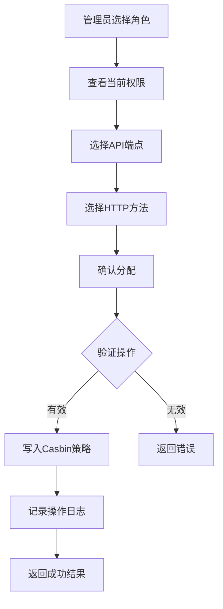
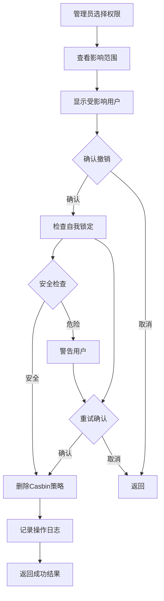
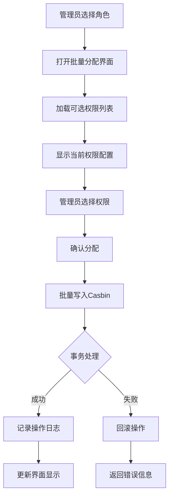

# Casbin API权限管理功能需求文档

## 📋 文档信息

- **项目名称**: OneOps 运维管理平台
- **功能模块**: Casbin API 权限管理
- **需求版本**: v1.0
- **编写日期**: 2026-08-05
- **需求类型**: 功能增强需求

---

## 🎯 功能概述

### 业务背景
当前 OneOps 系统已经实现了基础的权限管理，但是缺乏对 Casbin API 级权限的直接管理能力。Level 4 API 权限管理需要提供可视化的管理界面，让系统管理员能够：

1. 查看系统所有 API 端点定义
2. 为角色分配/撤销 API 访问权限
3. 查看角色的 API 权限配置
4. 批量管理 API 权限
5. 监控 API 权限使用情况

### 功能定位
- **功能类型**: 系统管理 → 权限管理 → API权限管理
- **用户群体**: 系统管理员、安全管理员
- **使用场景**: 权限配置、安全审计、权限优化

### 核心价值
1. **可视化权限管理**: 将代码级的权限配置转变为界面操作
2. **细粒度控制**: 支持到 API 端点和 HTTP 方法的精确控制
3. **权限透明化**: 清晰展示每个角色拥有哪些 API 权限
4. **安全性提升**: 便于审计和优化权限配置

---

## 📖 用户故事

### 主要用户故事

#### US-1: 查看 API 权限配置
**作为** 系统管理员  
**我想要** 查看系统中所有 API 端点和当前角色的权限配置  
**以便于** 了解系统的权限分配情况并进行安全审计

**验收标准**:
- 能看到按分类组织的所有 API 端点
- 能看到每个角色的权限分配状态
- 能看到权限统计信息（总API数、角色权限数等）

#### US-2: 为角色分配 API 权限
**作为** 系统管理员  
**我想要** 为指定角色分配 API 访问权限  
**以便于** 控制该角色能够访问的 API 端点

**验收标准**:
- 能选择角色和要分配的 API 权限
- 支持单个分配和批量分配
- 分配后立即生效
- 有清晰的权限变更记录

#### US-3: 撤销角色 API 权限
**作为** 系统管理员  
**我想要** 撤销角色的某些 API 权限  
**以便于** 收紧权限控制或纠正错误的权限分配

**验收标准**:
- 能选择要撤销的权限
- 撤销操作需要确认
- 撤销后立即生效
- 记录撤销操作日志

#### US-4: 批量权限管理
**作为** 系统管理员  
**我想要** 批量为角色分配多个 API 权限  
**以便于** 快速配置新角色的权限

**验收标准**:
- 能查看可选权限列表
- 支持穿梭框式的批量选择
- 能看到当前已有的权限配置
- 一次性保存多个权限变更

#### US-5: 权限配置验证
**作为** 系统管理员  
**我想要** 验证用户的 API 权限配置  
**以便于** 确认权限设置是否正确

**验收标准**:
- 能模拟检查指定用户的权限
- 能看到用户是否有特定 API 的访问权限
- 能查看用户的所有权限列表

---

## 🎨 功能需求

### F1: API 端点管理

#### F1.1 查看 API 端点列表
**优先级**: P0 (必须有)  
**需求描述**: 系统应显示所有已定义的 API 端点

**功能要求**:
- API 端点按模块分类显示（用户管理、角色管理、菜单管理等）
- 显示端点的完整信息：
  - API 名称（中文）
  - API 路径
  - 支持的 HTTP 方法（GET、POST、PUT、DELETE）
  - 功能描述
  - 所属分类

**界面要求**:
- 使用表格或卡片形式展示
- 支持按分类、名称、路径搜索过滤
- 清晰的视觉层次和信息组织

#### F1.2 API 端点详情
**优先级**: P1 (应该有)  
**需求描述**: 提供 API 端点的详细信息查看

**功能要求**:
- 显示端点的完整路径和参数说明
- 显示端点的功能描述
- 显示该端点在哪些角色中已授权
- 显示相关的权限码映射关系

### F2: 角色 API 权限管理

#### F2.1 查看角色权限
**优先级**: P0 (必须有)  
**需求描述**: 查看指定角色拥有的所有 API 权限

**功能要求**:
- 支持按角色筛选查看权限
- 显示权限列表（API 路径 + HTTP 方法）
- 显示权限统计（总数、按分类统计）
- 高亮显示已授权的 API 端点

**界面要求**:
- 角色选择器（下拉框）
- 权限列表展示（表格或树形结构）
- 权限状态标识（已授权/未授权）

#### F2.2 分配单个 API 权限
**优先级**: P0 (必须有)  
**需求描述**: 为角色分配单个 API 端点的访问权限

**功能要求**:
- 选择角色、API 端点、HTTP 方法
- 确认分配操作
- 立即生效（无需重启）
- 记录分配操作日志

**交互要求**:
- 操作前需要确认对话框
- 操作后有成功提示
- 错误时有明确的错误信息

#### F2.3 撤销 API 权限
**优先级**: P0 (必须有)  
**需求描述**: 撤销角色的特定 API 访问权限

**功能要求**:
- 选择要撤销的权限
- 撤销前需要二次确认
- 立即生效
- 记录撤销操作日志

**安全要求**:
- 防止撤销自己的权限（可能导致无法继续操作）
- 警告撤销关键权限的影响

#### F2.4 批量分配权限
**优先级**: P1 (应该有)  
**需求描述**: 一次性为角色分配多个 API 权限

**功能要求**:
- 显示所有可分配的权限列表
- 支持多选操作
- 显示当前已选权限
- 一次性保存多个权限变更

**界面要求**:
- 使用穿梭框（Transfer）组件
- 清晰的左右分组（可选/已选）
- 支持搜索和过滤
- 显示选中数量统计

### F3: 权限统计与监控

#### F3.1 权限统计概览
**优先级**: P1 (应该有)  
**需求描述**: 显示系统 API 权限的整体统计信息

**功能要求**:
- 显示统计指标：
  - 系统 API 总数
  - Casbin 策略总数
  - 各角色权限数量
  - 权限覆盖率
- 可视化图表展示
- 支持按角色、分类筛选

**界面要求**:
- 卡片式统计展示
- 数字化仪表板
- 饼图或柱状图可视化

#### F3.2 权限变更历史
**优先级**: P2 (可以有)  
**需求描述**: 记录和查看权限变更历史

**功能要求**:
- 记录所有权限分配/撤销操作
- 显示操作人、操作时间、操作详情
- 支持按时间、角色、操作类型筛选
- 支持权限变更回滚

### F4: 权限测试与验证

#### F4.1 权限检查工具
**优先级**: P1 (应该有)  
**需求描述**: 提供工具检查用户是否有特定 API 权限

**功能要求**:
- 输入用户、API 路径、HTTP 方法
- 显示权限检查结果
- 支持批量检查多个权限
- 显示检查结果的详细说明

**界面要求**:
- 简洁的输入表单
- 清晰的结果展示
- 颜色区分（有权限/无权限）

#### F4.2 权限影响分析
**优先级**: P2 (可以有)  
**需求描述**: 分析权限变更的影响范围

**功能要求**:
- 显示权限变更会影响哪些用户
- 显示可能影响的功能模块
- 提供权限变更建议和警告

---

## 🔧 技术需求

### T1: 后端技术实现

#### T1.1 API 接口设计
**优先级**: P0  
**需求描述**: 设计完整的 RESTful API 接口

**必需接口**:
```go
// 1. API端点管理
GET    /api/system/api-permissions/endpoints     // 获取所有API端点
GET    /api/system/api-permissions/stats        // 获取权限统计信息

// 2. 角色权限管理
GET    /api/system/api-permissions/roles/:roleCode           // 获取角色权限
POST   /api/system/api-permissions/assign                   // 分配权限
POST   /api/system/api-permissions/revoke                   // 撤销权限
POST   /api/system/api-permissions/batch-assign              // 批量分配

// 3. 权限验证
GET    /api/system/api-permissions/check                    // 检查权限
```

**技术要求**:
- 遵循 Level 4 API 级权限控制
- 所有接口需要权限验证
- 统一的响应格式
- 完善的错误处理

#### T1.2 数据模型
**优先级**: P0  
**需求描述**: 定义完整的数据模型

**数据结构**:
```go
// API端点定义
type SystemAPIEndpoint struct {
    ID          string   `json:"id"`
    Path        string   `json:"path"`
    Methods     []string `json:"methods"`
    Name        string   `json:"name"`
    Description string   `json:"description"`
    Category    string   `json:"category"`
}

// 角色权限
type RoleAPIPermission struct {
    RoleCode string `json:"roleCode"`
    Path     string `json:"path"`
    Method   string `json:"method"`
}

// 权限统计
type APIPermissionStats struct {
    TotalAPIs     int                    `json:"totalAPIs"`
    RoleStats     []RolePermissionStats   `json:"roleStats"`
    TotalPolicies int                    `json:"totalPolicies"`
}
```

#### T1.3 权限验证逻辑
**优先级**: P0  
**需求描述**: 实现基于 Casbin 的权限验证

**验证流程**:
1. 从请求头获取用户信息
2. 获取用户的角色列表
3. 使用 Casbin Enforcer 检查权限：`Enforcer.Enforce(roleCode, apiPath, httpMethod)`
4. 返回检查结果

**性能要求**:
- 权限检查响应时间 < 50ms
- 支持高并发场景
- 缓存常用权限检查结果

### T2: 前端技术实现

#### T2.1 界面框架
**优先级**: P0  
**需求描述**: 使用 Vue 3 + Element Plus 构建管理界面

**页面结构**:
```
/api-permission-management
├── APIEndpointList.vue      # API端点列表
├── RolePermissionList.vue   # 角色权限列表
├── PermissionAssignModal.vue # 权限分配对话框
└── PermissionStats.vue      # 权限统计展示
```

#### T2.2 组件设计
**优先级**: P1  
**需求描述**: 设计可复用的权限管理组件

**核心组件**:
- `APIEndpointTable`: API端点表格组件
- `RoleSelector`: 角色选择器组件
- `PermissionTransfer`: 权限穿梭框组件
- `PermissionChecker`: 权限检查工具组件

**组件要求**:
- 支持数据懒加载
- 支持虚拟滚动（大数据量）
- 统一的错误处理
- 统一的加载状态

#### T2.3 状态管理
**优先级**: P1  
**需求描述**: 使用 Vuex 管理权限状态

**状态设计**:
```typescript
interface APIPermissionState {
  endpoints: SystemAPIEndpoint[]    // 所有API端点
  rolePermissions: RolePermissions   // 角色权限映射
  stats: APIPermissionStats          // 权限统计
  selectedRole: string               // 当前选中的角色
}
```

---

## 🎨 界面需求

### UI1: 主界面布局

#### UI1.1 页面结构
**优先级**: P0  
**需求描述**: 定义主界面的整体布局

**布局要求**:
```
┌─────────────────────────────────────────────────┐
│ API权限管理                          [权限统计]  │
├─────────────────────────────────────────────────┤
│                                                 │
│  [角色选择]  [批量分配]  [权限测试]             │
│                                                 │
│  ┌─────────────────────────────────────────┐  │
│  │  API端点分类                          │  │
│  ├─────────────────────────────────────────┤  │
│  │  用户管理 (7个API)                    │  │
│  │  角色管理 (7个API)                    │  │
│  │  菜单管理 (6个API)                    │  │
│  │  权限管理 (6个API)                    │  │
│  └─────────────────────────────────────────┘  │
│                                                 │
│  [API端点详细列表 - 表格视图]                │
│                                                 │
└─────────────────────────────────────────────────┘
```

**组件要求**:
- 顶部：页面标题和操作按钮
- 中部：角色选择和功能按钮
- 主体：API端点分类和详细列表
- 响应式设计，适配不同屏幕尺寸

#### UI1.2 权限统计卡片
**优先级**: P1  
**需求描述**: 显示权限统计信息

**展示内容**:
- 系统 API 总数
- Casbin 策略总数
- 各角色权限数量
- 权限覆盖率

**视觉要求**:
- 使用统计卡片组件
- 数字化展示
- 图标辅助理解
- 颜色区分不同数据

### UI2: API端点列表

#### UI2.1 表格列设计
**优先级**: P0  
**需求描述**: 设计清晰的表格列

**列定义**:
| 列名 | 宽度 | 说明 | 操作 |
|------|------|------|------|
| API名称 | 150px | 中文名称 | - |
| API路径 | 300px | 完整路径 | - |
| HTTP方法 | 120px | GET/POST/PUT/DELETE | - |
| 分类 | 100px | 所属模块 | - |
| 权限状态 | 100px | 已授权/未授权 | - |
| 操作 | 150px | 分配/撤销 | 按钮 |

**交互要求**:
- 支持排序
- 支持筛选
- 支持搜索
- 行选中操作

#### UI2.2 权限状态标识
**优先级**: P0  
**需求描述**: 清晰标识权限状态

**状态设计**:
- **已授权**: 显示绿色标识或图标
- **部分授权**: 显示黄色标识（部分HTTP方法有权限）
- **未授权**: 显示灰色标识

**视觉设计**:
```
已授权: ✓ 全部方法已授权
部分授权: ◐ 部分方法已授权
未授权: ✗ 未授权
```

### UI3: 权限分配对话框

#### UI3.1 批量分配界面
**优先级**: P0  
**需求描述**: 设计直观的批量分配界面

**界面结构**:
```
┌────────────────────────────────────────┐
│ 批量分配API权限                          │
├────────────────────────────────────────┤
│ 选择角色: [下拉选择器]                 │
│                                          │
│ ┌──────┐    ┌──────┐                │
│ │可选  │ -> │已选  │                │
│ │权限  │    │权限  │                │
│ │      │    │      │                │
│ └──────┘    └──────┘                │
│                                          │
│ 已选: 15个权限                          │
│                                          │
│ [取消]           [保存分配]            │
└────────────────────────────────────────┘
```

**功能要求**:
- 左右穿梭框设计
- 支持搜索过滤
- 显示选中数量
- 确认/取消操作

#### UI3.2 单个权限分配
**优先级**: P1  
**需求描述**: 单个权限的快速分配

**交互设计**:
- 在表格中点击操作按钮
- 弹出确认对话框
- 选择HTTP方法（如果有多个）
- 确认分配

### UI4: 权限测试工具

#### UI4.1 权限检查界面
**优先级**: P1  
**需求描述**: 提供权限检查工具

**界面设计**:
```
┌────────────────────────────────────────┐
│ 权限测试工具                              │
├────────────────────────────────────────┤
│ 用户: [用户选择器]                      │
│ API路径: [输入框]                        │
│ HTTP方法: [GET/POST/PUT/DELETE]        │
│                                          │
│ [检查权限]  [批量测试]                  │
│                                          │
│ ┌──────────────────────────────────┐  │
│ │ 检查结果                          │  │
│ │ ✓ 用户 admin 有此权限            │  │
│ │ 权限来源: 角色 admin               │  │
│ └──────────────────────────────────┘  │
└────────────────────────────────────────┘
```

---

## 🔒 权限与安全需求

### S1. 权限控制要求

#### S1.1 操作权限
**必需权限**: `system.api-permission.manage`  
**权限范围**: 仅超级管理员和安全管理员可访问

**权限验证**:
- 页面访问权限验证
- API 接口权限验证
- 操作级权限验证（分配、撤销）

#### S1.2 防护措施
**优先级**: P0  
**需求描述**: 防止误操作和安全风险

**防护措施**:
1. **防止自我锁定**: 禁止撤销自己的权限
2. **操作确认**: 关键操作需要二次确认
3. **权限警告**: 危险操作显示警告信息
4. **操作日志**: 记录所有权限变更操作

#### S1.3 数据验证
**优先级**: P0  
**需求描述**: 严格的输入数据验证

**验证规则**:
- 角色代码必须存在
- API 路径必须有效
- HTTP 方法必须合法
- 防止 SQL 注入
- 防止 XSS 攻击

### S2. 审计需求

#### S2.1 操作日志
**优先级**: P1  
**需求描述**: 记录所有权限变更操作

**日志内容**:
- 操作人（用户名、ID）
- 操作时间
- 操作类型（分配/撤销）
- 目标角色
- 变更的权限详情
- 操作结果（成功/失败）

#### S2.2 安全事件监控
**优先级**: P2  
**需求描述**: 监控异常权限操作

**监控指标**:
- 频繁的权限变更
- 批量撤销权限操作
- 非工作时间权限变更
- 敏感权限的变更

---

## 📊 数据模型需求

### D1: 系统API端点定义

#### D1.1 API端点注册表
**优先级**: P0  
**需求描述**: 定义系统中所有 API 端点

**数据来源**:
- 代码中硬编码定义
- 自动扫描路由生成
- 手动配置管理

**存储方式**:
- 代码定义（Go 结构体）
- 数据库表存储（可选）
- 缓存提升性能

#### D1.2 API端点分类
**优先级**: P1  
**需求描述**: 为 API 端点提供分类组织

**分类体系**:
- 用户管理 (user)
- 角色管理 (role)
- 菜单管理 (menu)
- 权限管理 (permission)
- CMDB管理 (cmdb)
- 监控管理 (monitoring)
- 审计管理 (audit)
- K8s管理 (k8s)

### D2: Casbin 策略管理

#### D2.1 策略存储
**优先级**: P0  
**需求描述**: 使用 Casbin 标准策略格式

**策略格式**:
```csv
p, role_code, /api/system/users, GET
p, role_code, /api/system/users, POST
p, role_code, /api/system/users/:id, PUT
p, role_code, /api/system/users/:id, DELETE
```

**存储表**: `casbin_rule`
- p_type: 策略类型 (p)
- v0: 角色 (role_code)
- v1: API路径
- v2: HTTP方法
- v3-v5: 扩展字段

#### D2.2 策略同步
**优先级**: P1  
**需求描述**: 确保策略一致性

**同步机制**:
- 分配权限时写入 Casbin
- 撤销权限时删除 Casbin 策略
- 批量操作时事务处理
- 失败回滚机制

### D3: 角色权限关系

#### D3.1 多对多关系
**优先级**: P0  
**需求描述**: 角色与权限是多对多关系

**关系表示**:
- 一个角色可以有多个 API 权限
- 一个 API 权限可以分配给多个角色
- 支持角色继承（可选功能）

---

## 🔄 业务流程需求

### BF1: 权限分配流程

#### 流程图


#### 异常处理
1. **权限不足**: 提示用户无操作权限
2. **角色不存在**: 提示角色不存在，返回角色列表
3. **API无效**: 提示API端点未注册
4. **写入失败**: 显示详细错误信息，回滚操作
5. **网络异常**: 提示网络问题，支持重试

### BF2: 权限撤销流程

#### 流程图


#### 安全检查
1. **自我锁定检查**: 防止撤销自己的权限
2. **依赖关系检查**: 检查其他权限是否依赖此权限
3. **影响范围分析**: 显示受影响的用户和功能

### BF3: 批量分配流程

#### 流程图


---

## 🧪 测试需求

### T1: 功能测试需求

#### T1.1 权限查看测试
- 验证能正确显示所有 API 端点
- 验证能正确显示角色权限
- 验证权限统计准确性
- 验证权限状态标识正确

#### T1.2 权限分配测试
- 验证单个权限分配功能
- 验证批量权限分配功能
- 验证权限立即生效
- 验证权限持久化存储

#### T1.3 权限撤销测试
- 验证单个权限撤销功能
- 验证批量权限撤销功能
- 验证撤销立即生效
- 验证撤销操作日志

### T2: 安全测试需求

#### T2.1 权限控制测试
- 验证无权限用户无法访问
- 验证权限检查的准确性
- 验证权限继承（如有）
- 验证权限优先级

#### T2.2 数据安全测试
- 验证输入数据验证
- 验证 SQL 注入防护
- 验证 XSS 攻击防护
- 验证 CSRF 防护

#### T2.3 业务安全测试
- 验证自我锁定保护
- 验证批量操作保护
- 验证权限变更审计
- 验证异常情况处理

### T3: 性能测试需求

#### T3.1 响应时间要求
- API 端点列表加载: < 1秒
- 权限检查响应: < 50ms
- 批量分配操作: < 2秒
- 权限统计计算: < 500ms

#### T3.2 并发测试要求
- 支持 50 个并发用户同时查看权限
- 支持 10 个并发分配操作
- 支持 1000 个权限检查请求/秒

---

## 📱 非功能需求

### N1: 易用性需求

#### N1.1 界面友好性
- 操作流程简洁直观
- 错误提示清晰明确
- 帮助文档完善
- 快捷键支持

#### N1.2 学习成本
- 界面符合用户习惯
- 专业术语有说明
- 提供操作引导
- 提供示例数据

### N2: 性能需求

#### N2.1 响应速度
- 页面加载时间: < 2秒
- 操作响应时间: < 500ms
- 批量操作: < 3秒
- 权限检查: < 100ms

#### N2.2 数据处理能力
- 支持 1000+ API 端点
- 支持 50+ 角色
- 支持 10000+ 权限策略
- 支持实时权限检查

### N3: 兼容性需求

#### N3.1 浏览器兼容
- Chrome 90+
- Firefox 88+
- Safari 14+
- Edge 90+

#### N3.2 设备兼容
- 桌面设备: 1920x1080+
- 平板设备: 1024x768+
- 响应式设计

### N4: 可维护性需求

#### N4.1 代码质量
- 代码注释完整
- 模块化设计
- 错误处理完善
- 日志记录详细

#### N4.2 可扩展性
- 支持新增 API 端点
- 支持自定义权限策略
- 支持权限继承
- 支持权限模板

---

## ✅ 验收标准

### AC1: 功能验收标准

#### AC1.1 API端点管理
- [ ] 能显示系统中所有已注册的 API 端点
- [ ] API 端点按分类正确组织
- [ ] 能搜索和过滤 API 端点
- [ ] 能查看 API 端点详细信息

#### AC1.2 权限查看功能
- [ ] 能查看任意角色的权限配置
- [ ] 权限列表显示完整准确
- [ ] 权限状态标识清晰
- [ ] 能显示权限统计信息

#### AC1.3 权限分配功能
- [ ] 能成功分配单个权限
- [ ] 能成功批量分配权限
- [ ] 分配后立即生效
- [ ] 分配操作有日志记录

#### AC1.4 权限撤销功能
- [ ] 能成功撤销单个权限
- [ ] 能成功批量撤销权限
- [ ] 撤销后立即生效
- [ ] 撤销操作有日志记录

### AC2: 性能验收标准

- [ ] 页面加载时间 < 2秒
- [ ] 权限检查响应 < 50ms
- [ ] 支持 50+ 并发用户
- [ ] 支持 1000+ 权限检查QPS

### AC3: 安全验收标准

- [ ] 所有操作有权限验证
- [ ] 防止自我锁定
- [ ] 输入数据验证完整
- [ ] 操作日志记录完整

### AC4: 易用性验收标准

- [ ] 界面直观易用
- [ ] 操作流程清晰
- [ ] 错误提示明确
- [ ] 帮助文档完善

---

## 🚀 实施计划

### Phase 1: 核心功能 (P0)
**目标**: 实现基础的 API 权限管理功能

**功能列表**:
1. API 端点列表展示
2. 角色权限查看
3. 单个权限分配
4. 单个权限撤销
5. 权限统计概览

**交付物**:
- 后端 API 接口
- 前端管理页面
- 基础权限检查功能

### Phase 2: 高级功能 (P1)
**目标**: 实现批量管理和权限测试

**功能列表**:
1. 批量权限分配
2. 权限检查工具
3. 权限变更历史
4. 权限影响分析

**交付物**:
- 批量操作界面
- 权限测试工具
- 操作日志查询

### Phase 3: 优化功能 (P2)
**目标**: 提升用户体验和系统性能

**功能列表**:
1. 权限模板功能
2. 权限推荐功能
3. 权限依赖分析
4. 性能优化

**交付物**:
- 权限模板系统
- 智能推荐算法
- 性能优化报告

---

## 📝 附录

### A1: 术语表

| 术语 | 英文 | 说明 |
|------|------|------|
| API端点 | API Endpoint | 系统中的HTTP接口 |
| HTTP方法 | HTTP Method | GET/POST/PUT/DELETE等 |
| Casbin | Casbin | 开源访问控制库 |
| 策略 | Policy | Casbin中的权限规则 |
| 角色 | Role | 用户角色定义 |
| 权限 | Permission | 访问权限 |

### A2: 参考资料

1. Casbin 官方文档: https://casbin.org/
2. Level 4 权限设计文档: PERMISSION_ARCHITECTURE.md
3. 系统管理 API 分析: SYSTEM_MANAGEMENT_API_ANALYSIS.md
4. 前端开发规范: TypeScript/JavaScript Coding Style

### A3: 变更记录

| 版本 | 日期 | 变更内容 | 变更人 |
|------|------|----------|--------|
| v1.0 | 2026-08-05 | 初始版本创建 | Claude |

---

*需求文档编写完成时间: 2026-08-05*
*下一步: 根据此需求进行功能设计和开发*