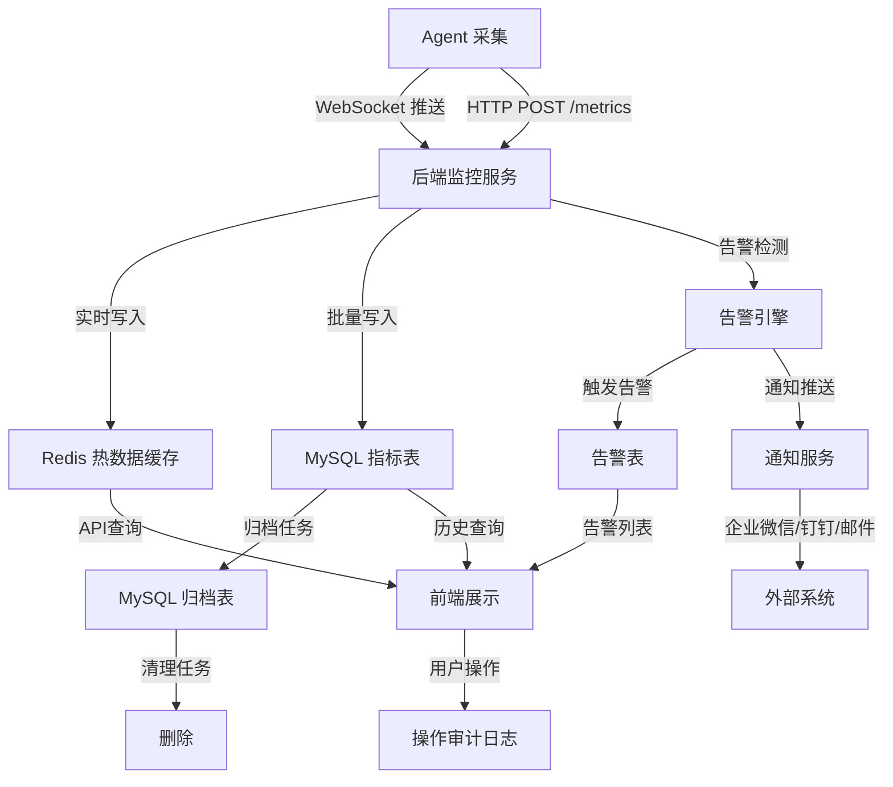

# OneOps Agent 监控系统架构优化方案

## 文档信息

| 项目     | 内容                              |
| -------- | --------------------------------- |
| 文档版本 | v3.0 (架构优化版)                  |
| 创建日期 | 2026-05-27                        |
| 作者     | OneOps 架构组                      |
| 状态     | 架构优化阶段（全域闭环自洽设计）   |
| 优化内容 | 权限体系、数据流、交互、容错全方位优化 |

---

## 一、核心架构优化

### 1.1 菜单结构优化（去重与整合）

**优化前问题**：
- 监控配置与告警管理功能重叠
- 主机监控与主机资产数据重复

**优化后菜单结构**：

```
📊 监控中心（一级菜单）
│
├── 📈 监控概览 (monitoring/overview) [默认页]
│   ├── 总览仪表板
│   │   ├── 主机状态卡片（在线/离线/告警）
│   │   ├── 资源使用率汇总
│   │   └── 告警统计（各级别数量+趋势）
│   ├── 资源 Top 10
│   │   ├── CPU/内存/磁盘使用率排行
│   │   └── 点击跳转到主机监控详情
│   └── 实时告警列表（最新10条，支持快速确认）
│
├── 🔔 告警管理 (monitoring/alerts)
│   ├── 实时告警
│   │   ├── 告警列表（筛选级别/主机/时间）
│   │   ├── 告警详情（关联主机监控数据）
│   │   ├── 批量确认/导出
│   │   └── 告警抑制规则（新增）
│   ├── 告警历史
│   │   ├── 历史查询（时间范围/主机）
│   │   ├── 告警趋势图
│   │   └── 告警统计分析（MTTA/MTTR）
│   └── 告警配置（整合原监控设置中的告警部分）
│       ├── 告警规则管理
│       ├── 通知渠道配置
│       └── 告警静默策略
│
├── 📉 趋势分析 (monitoring/trends)
│   ├── 性能趋势
│   │   ├── 多维度趋势图（CPU/内存/磁盘/网络）
│   │   ├── 时间范围选择（1h/6h/24h/7d/30d/custom）
│   │   └── 多主机对比分析
│   ├── 容量预测
│   │   ├── 磁盘空间预测（线性回归/趋势外推）
│   │   ├── 内存使用预测
│   │   └── 容量告警阈值建议
│   └── 异常检测（新增）
│       ├── 基线偏差检测
│       ├── 突变检测
│       └── 周期性异常识别
│
├── 🔍 主机监控 (monitoring/servers)
│   ├── 主机列表（监控视图）
│   │   ├── 性能指标列（CPU/内存/磁盘实时值）
│   │   ├── 迷你趋势图（最近1小时）
│   │   ├── 服务状态图标
│   │   ├── 告警徽章
│   │   └── 快捷操作（监控详情/连接）
│   ├── 监控详情页（主机维度）
│   │   ├── 实时性能仪表盘
│   │   ├── 服务状态监控
│   │   ├── 进程监控（Top 20）
│   │   ├── 网络连接状态
│   │   ├── 硬件资产信息
│   │   ├── 网络配置详情
│   │   ├── 安全基线检查
│   │   └── 历史趋势图表
│   └── 巡检报告（新增）
│       ├── 自动巡检任务配置
│       ├── 巡检执行记录
│       ├── 巡检结果详情
│       └── 报告导出（PDF/Excel）
│
└── ⚙️ 系统配置 (system/settings) [移至系统管理下]
    ├── 监控采集配置
    │   ├── 采集频率设置
    │   ├── 指标启用/禁用
    │   └── 数据保留策略
    └── 告警全局配置
        ├── 免打扰时间配置
        ├── 告警聚合策略
        └── 告警升级规则
```

**关键变更**：
1. ✅ 将"监控配置"移除，告警规则/通知渠道整合到"告警管理 → 告警配置"
2. ✅ 系统配置移至"系统管理"下，保持全局配置的一致性
3. ✅ 新增"巡检报告"和"异常检测"功能模块
4. ✅ 去除与主机资产的重复，主机监控专注于监控数据展示

### 1.2 数据流架构优化

**优化后的数据流**：



**关键优化点**：

1. **实时性保障**：
   - Agent 使用 WebSocket 长连接，指标变化实时推送
   - Redis 缓存最近 5 分钟数据，前端查询优先走缓存
   - 告警触发后通过 WebSocket 推送到前端

2. **数据一致性**：
   - Agent 采集数据时间戳以**Agent端时间**为准，避免网络延迟影响
   - 后端接收时记录**接收时间**，用于监控数据上报延迟
   - 数据库使用事务确保指标和告警同时写入

3. **性能优化**：
   - 批量写入：每 30 秒批量写入一次历史指标数据
   - 异步通知：告警通知异步发送，不阻塞告警记录
   - 分区表：按月分区，查询和归档更高效

### 1.3 权限体系优化（全域闭环）

**权限矩阵设计**：

```typescript
// 监控中心完整权限定义
interface MonitoringPermissions {
  // ============ 监控概览权限 ============
  /** 查看监控概览 */
  'monitoring:overview:view': boolean;

  // ============ 告警管理权限 ============
  /** 查看告警列表 */
  'monitoring:alerts:view': boolean;
  /** 确认告警 */
  'monitoring:alerts:acknowledge': boolean;
  /** 关闭告警 */
  'monitoring:alerts:resolve': boolean;
  /** 查看告警配置 */
  'monitoring:alerts:config:view': boolean;
  /** 修改告警规则 */
  'monitoring:alerts:rules:modify': boolean;
  /** 修改通知渠道 */
  'monitoring:alerts:channels:modify': boolean;
  /** 导出告警数据 */
  'monitoring:alerts:export': boolean;

  // ============ 趋势分析权限 ============
  /** 查看趋势分析 */
  'monitoring:trends:view': boolean;
  /** 查看容量预测 */
  'monitoring:trends:forecast:view': boolean;
  /** 导出趋势数据 */
  'monitoring:trends:export': boolean;

  // ============ 主机监控权限 ============
  /** 查看主机监控 */
  'monitoring:servers:view': boolean;
  /** 查看主机详情 */
  'monitoring:servers:detail:view': boolean;
  /** 远程服务启停控制 */
  'monitoring:servers:service:control': boolean;
  /** 查看硬件资产 */
  'monitoring:servers:hardware:view': boolean;
  /** 查看安全基线 */
  'monitoring:servers:security:view': boolean;

  // ============ 巡检报告权限 ============
  /** 查看巡检报告 */
  'monitoring:reports:view': boolean;
  /** 生成巡检报告 */
  'monitoring:reports:generate': boolean;
  /** 导出巡检报告 */
  'monitoring:reports:export': boolean;
  /** 配置巡检任务 */
  'monitoring:reports:configure': boolean;

  // ============ 系统配置权限 ============
  /** 查看系统配置 */
  'monitoring:config:view': boolean;
  /** 修改采集配置 */
  'monitoring:config:collection:modify': boolean;
  /** 修改全局告警配置 */
  'monitoring:config:alerts:modify': boolean;

  // ============ 数据权限（主机范围） ============
  /** 查看全部主机 */
  'monitoring:data:all': boolean;
  /** 仅查看所属主机组的主机 */
  'monitoring:data:group': boolean;
  /** 仅看自己负责的主机 */
  'monitoring:data:self': boolean;
}

// 权限继承规则
const permissionInheritance = {
  // 超级管理员继承所有权限
  'admin': ['*'],

  // 运维工程师继承大部分权限
  'ops': [
    'monitoring:overview:view',
    'monitoring:alerts:*',
    'monitoring:trends:*',
    'monitoring:servers:*',
    'monitoring:reports:view',
    'monitoring:reports:export',
  ],

  // 运维分析师仅查看权限
  'analyst': [
    'monitoring:overview:view',
    'monitoring:alerts:view',
    'monitoring:trends:view',
    'monitoring:servers:view',
    'monitoring:servers:detail:view',
    'monitoring:reports:view',
  ],

  // 系统管理员配置权限
  'system_admin': [
    'monitoring:overview:view',
    'monitoring:alerts:*',
    'monitoring:config:*',
  ],
};
```

**数据权限实现**：

```go
// 后端数据权限中间件
func DataScopeMiddleware() gin.HandlerFunc {
    return func(ctx *gin.Context) {
        userID := getUserID(ctx)
        userRole := getUserRole(ctx)

        // 检查是否有查看全部主机的权限
        if hasPermission(userID, "monitoring:data:all") {
            ctx.Set("dataScope", "all")
            ctx.Next()
            return
        }

        // 检查是否有查看主机组的权限
        if hasPermission(userID, "monitoring:data:group") {
            userGroups := getUserGroups(userID)
            ctx.Set("dataScope", "group")
            ctx.Set("allowedGroups", userGroups)
            ctx.Next()
            return
        }

        // 默认仅查看自己负责的主机
        responsibleServers := getResponsibleServers(userID)
        ctx.Set("dataScope", "self")
        ctx.Set("responsibleServers", responsibleServers)
        ctx.Next()
    }
}

// 应用数据权限到查询
func ApplyDataScope(query *gorm.DB, ctx *gin.Context) *gorm.DB {
    dataScope := ctx.GetString("dataScope")

    switch dataScope {
    case "all":
        return query
    case "group":
        groups := ctx.MustGet("allowedGroups").([]string)
        return query.Joins("INNER JOIN server_tag_relations ON servers.id = server_tag_relations.server_id").
                   Joins("INNER JOIN server_tags ON server_tag_relations.tag_id = server_tags.id").
                   Where("server_tags.name IN ?", groups)
    case "self":
        servers := ctx.MustGet("responsibleServers").([]int)
        return query.Where("servers.id IN ?", servers)
    default:
        return query.Where("1 = 0") // 无权限
    }
}
```

**前端权限控制**：

```typescript
// 权限指令
const vPermission = {
  mounted(el: HTMLElement, binding: DirectiveBinding) {
    const permission = binding.value as string;
    if (!hasPermission(permission)) {
      el.style.display = 'none';
    }
  }
};

// 使用示例
<el-button v-permission="'monitoring:alerts:acknowledge'">
  确认告警
</el-button>

// 路由守卫
router.beforeEach((to, from, next) => {
  if (to.meta.permission) {
    if (!hasPermission(to.meta.permission)) {
      ElMessage.error('您没有访问该页面的权限');
      next({ name: 'dashboard' });
      return;
    }
  }
  next();
});
```

### 1.4 交互设计优化（统一操作范式）

**1. 统一的操作反馈**：

```typescript
// 操作状态管理
interface OperationState {
  loading: boolean;
  success: boolean;
  error: string | null;
  data?: any;
}

// 通用操作处理函数
async function handleOperation(
  operation: () => Promise<any>,
  options: {
    loadingMessage?: string;
    successMessage?: string;
    errorMessage?: string;
    onSuccess?: (data: any) => void;
    onError?: (error: any) => void;
  }
) {
  const { loadingMessage, successMessage, errorMessage, onSuccess, onError } = options;

  try {
    // 显示加载状态
    if (loadingMessage) {
      ElMessage.info({
        message: loadingMessage,
        duration: 2000,
      });
    }

    // 执行操作
    const result = await operation();

    // 成功反馈
    if (successMessage) {
      ElMessage.success(successMessage);
    }

    onSuccess?.(result);
  } catch (error: any) {
    // 错误处理
    const message = errorMessage || error?.message || '操作失败';
    ElMessage.error(message);
    onError?.(error);
  }
}
```

**2. 批量操作规范**：

```vue
<template>
  <div class="batch-operations">
    <!-- 批量选择栏 -->
    <div v-if="selectedRows.length > 0" class="batch-bar">
      <span class="selected-count">已选择 {{ selectedRows.length }} 项</span>

      <div class="batch-actions">
        <el-button
          v-permission="'monitoring:alerts:acknowledge'"
          :disabled="!canBatchAcknowledge"
          @click="handleBatchAcknowledge"
        >
          批量确认
        </el-button>
        <el-button
          v-permission="'monitoring:alerts:resolve'"
          :disabled="!canBatchResolve"
          @click="handleBatchResolve"
        >
          批量关闭
        </el-button>
        <el-button @click="handleExport">
          导出
        </el-button>
        <el-button type="link" @click="clearSelection">
          取消选择
        </el-button>
      </div>
    </div>
  </div>
</template>
```

**3. 快捷操作优化**：

```typescript
// 快捷键定义
const monitoringShortcuts = {
  // 刷新当前页面
  'r': () => refreshData(),
  'R': () => refreshData(),

  // 切换时间范围（趋势页面）
  '1': () => setTimeRange('1h'),
  '2': () => setTimeRange('6h'),
  '3': () => setTimeRange('24h'),
  '4': () => setTimeRange('7d'),
  '5': () => setTimeRange('30d'),

  // 确认告警（告警页面）
  'a': () => acknowledgeSelectedAlert(),
  'A': () => acknowledgeAllAlerts(),

  // 搜索
  '/': () => focusSearchInput(),

  // 导出
  'e': () => exportCurrentData(),
};

// 全局快捷键注册
onMounted(() => {
  Object.entries(monitoringShortcuts).forEach(([key, handler]) => {
    window.addEventListener('keydown', (e) => {
      // 检查是否在输入框中
      if (['INPUT', 'TEXTAREA', 'SELECT'].includes((e.target as HTMLElement).tagName)) {
        return;
      }

      if (e.key === key) {
        e.preventDefault();
        handler();
      }
    });
  });
});
```

### 1.5 视觉设计优化（统一配色体系）

**1. 告警级别配色**：

```scss
// 告警级别主题色（统一前后端）
$alert-critical: #f56c6c;  // 红色 - 严重
$alert-high: #e6a23c;      // 橙色 - 高级
$alert-medium: #f0ad4e;    // 黄色 - 中级
$alert-low: #409eff;       // 蓝色 - 低级
$alert-info: #909399;      // 灰色 - 信息
$alert-resolved: #67c23a;  // 绿色 - 已恢复

// 告警级别标签样式
.el-tag {
  &.tag-critical {
    background-color: rgba($alert-critical, 0.1);
    border-color: $alert-critical;
    color: $alert-critical;
  }

  &.tag-high {
    background-color: rgba($alert-high, 0.1);
    border-color: $alert-high;
    color: $alert-high;
  }

  &.tag-medium {
    background-color: rgba($alert-medium, 0.1);
    border-color: $alert-medium;
    color: $alert-medium;
  }

  &.tag-low {
    background-color: rgba($alert-low, 0.1);
    border-color: $alert-low;
    color: $alert-low;
  }
}

// 告警状态指示器
.alert-indicator {
  &.critical {
    animation: pulse-critical 2s infinite;
  }

  &.high {
    animation: pulse-high 2s infinite;
  }
}

@keyframes pulse-critical {
  0%, 100% { opacity: 1; }
  50% { opacity: 0.6; }
}

@keyframes pulse-high {
  0%, 100% { opacity: 1; }
  50% { opacity: 0.7; }
}
```

**2. 资源使用率配色**：

```scss
// 资源使用率渐变色
$usage-low: #67c23a;      // 0-50% 绿色
$usage-medium: #e6a23c;    // 50-80% 橙色
$usage-high: #f56c6c;      // 80-90% 红色
$usage-critical: #f56c6c;  // 90-100% 深红色

// 使用率进度条
.usage-progress {
  &.progress-low {
    .el-progress-bar__inner {
      background: linear-gradient(90deg, $usage-low 0%, lighten($usage-low, 10%) 100%);
    }
  }

  &.progress-medium {
    .el-progress-bar__inner {
      background: linear-gradient(90deg, $usage-medium 0%, lighten($usage-medium, 10%) 100%);
    }
  }

  &.progress-high {
    .el-progress-bar__inner {
      background: linear-gradient(90deg, $usage-high 0%, lighten($usage-high, 10%) 100%);
      animation: progress-warning 2s infinite;
    }
  }

  &.progress-critical {
    .el-progress-bar__inner {
      background: linear-gradient(90deg, $usage-critical 0%, darken($usage-critical, 10%) 100%);
      animation: progress-critical 1s infinite;
    }
  }
}

@keyframes progress-warning {
  0%, 100% { opacity: 1; }
  50% { opacity: 0.7; }
}

@keyframes progress-critical {
  0%, 100% { opacity: 1; }
  50% { opacity: 0.5; }
}
```

**3. 图表配色**：

```typescript
// ECharts 主题配置
export const monitoringChartTheme = {
  color: [
    '#5470c6', // 主蓝色
    '#91cc75', // 绿色
    '#fac858', // 黄色
    '#ee6666', // 红色
    '#73c0de', // 浅蓝色
    '#3ba272', // 深绿色
    '#fc8452', // 橙色
    '#9a60b4', // 紫色
  ],

  // 趋势图渐变填充
  areaStyle: {
    color: new echarts.graphic.LinearGradient(0, 0, 0, 1, [
      { offset: 0, color: 'rgba(91, 143, 249, 0.3)' },
      { offset: 1, color: 'rgba(91, 143, 249, 0.05)' }
    ])
  },

  // 告警阈值线
  markLine: {
    data: [
      {
        type: 'line',
        yAxis: 60,
        lineStyle: { color: '#e6a23c', type: 'dashed' },
        label: { formatter: '警告: {c}%' }
      },
      {
        type: 'line',
        yAxis: 80,
        lineStyle: { color: '#f56c6c', type: 'solid' },
        label: { formatter: '严重: {c}%' }
      }
    ]
  }
};
```

---

## 二、数据流闭环优化

### 2.1 采集与存储流程

```go
// 数据采集链路
type MetricsCollectionPipeline struct {
    // Agent 上报
    agentReport  <-chan *AgentMetricsReport
    // 数据校验
    validator    *MetricsValidator
    // 实时缓存
    redisCache   *RedisClient
    // 持久化队列
    persistQueue chan *PersistMetric
    // 告警检测
    alertEngine  *AlertEngine
    // 通知发送
    notifier     *NotificationService
}

// Agent 上报数据结构（统一格式）
type AgentMetricsReport struct {
    AgentID     string                 `json:"agent_id"`
    ServerID    int                    `json:"server_id"`
    ReportTime  time.Time              `json:"report_time"`
    Metrics     map[string]interface{} `json:"metrics"`
    // 性能指标
    Performance *PerformanceMetrics    `json:"performance,omitempty"`
    // 系统信息
    System      *SystemInfo           `json:"system,omitempty"`
    // 硬件信息（低频）
    Hardware    *HardwareInfo         `json:"hardware,omitempty"`
    // 服务状态
    Services    *ServiceStatus        `json:"services,omitempty"`
    // 进程信息
    Processes   *ProcessInfo          `json:"processes,omitempty"`
    // 网络配置
    Network     *NetworkConfig        `json:"network,omitempty"`
    // 安全信息
    Security    *SecurityInfo         `json:"security,omitempty"`
}

// 数据处理流程
func (p *MetricsCollectionPipeline) ProcessReport(report *AgentMetricsReport) error {
    // 1. 数据校验
    if err := p.validator.Validate(report); err != nil {
        return fmt.Errorf("数据校验失败: %w", err)
    }

    // 2. 写入实时缓存（5分钟热数据）
    p.redisCache.Set(
        fmt.Sprintf("metrics:realtime:%d", report.ServerID),
        report.Metrics,
        5*time.Minute,
    )

    // 3. 异步持久化
    p.persistQueue <- &PersistMetric{
        ServerID:   report.ServerID,
        MetricType: "performance",
        MetricData: report.Performance,
        ReportTime: report.ReportTime,
    }

    // 4. 实时告警检测
    go p.alertEngine.Evaluate(report)

    // 5. 更新主机状态
    go p.updateServerStatus(report)

    return nil
}

// 批量持久化（每30秒）
func (p *MetricsCollectionPipeline) StartPersistWorker() {
    ticker := time.NewTicker(30 * time.Second)
    batch := make([]*PersistMetric, 0, 1000)

    go func() {
        for {
            select {
            case metric := <-p.persistQueue:
                batch = append(batch, metric)

                // 达到批次大小或定时触发
                if len(batch) >= 1000 {
                    p.persistBatch(batch)
                    batch = make([]*PersistMetric, 0, 1000)
                }

            case <-ticker.C:
                if len(batch) > 0 {
                    p.persistBatch(batch)
                    batch = make([]*PersistMetric, 0, 1000)
                }
            }
        }
    }()
}
```

### 2.2 告警检测与通知流程

```go
// 告警状态机
type AlertStateMachine struct {
    states map[string]*AlertState
    mu     sync.RWMutex
}

type AlertState struct {
    AlertID    string
    RuleID     string
    ServerID   int
    Status     string // "pending", "firing", "resolved", "acknowledged"
    FirstSeen  time.Time
    LastSeen   time.Time
    AckedBy    *string
    AckedAt    *time.Time
    ResolvedAt *time.Time
    History    []AlertStateChange
}

type AlertStateChange struct {
    From   string
    To     string
    Reason string
    Time   time.Time
    User   *string
}

// 告警评估引擎
func (e *AlertEngine) Evaluate(report *AgentMetricsReport) {
    rules := e.getActiveRules()

    for _, rule := range rules {
        // 检查规则是否匹配
        if e.matchRule(rule, report) {
            // 获取或创建告警状态
            state := e.getOrCreateState(rule, report.ServerID)

            // 状态转换逻辑
            e.transitionState(state, report, rule)
        }
    }
}

// 状态转换逻辑
func (e *AlertEngine) transitionState(
    state *AlertState,
    report *AgentMetricsReport,
    rule *AlertRule,
) {
    e.mu.Lock()
    defer e.mu.Unlock()

    now := time.Now()
    oldStatus := state.Status

    switch state.Status {
    case "pending":
        // 检查是否满足持续时间
        if now.Sub(state.FirstSeen) >= rule.Duration {
            state.Status = "firing"
            state.History = append(state.History, AlertStateChange{
                From:   "pending",
                To:     "firing",
                Reason: fmt.Sprintf("持续 %v 触发阈值", rule.Duration),
                Time:   now,
            })

            // 触发通知
            go e.notifyAlert(state, report)
        }

    case "firing":
        // 检查是否恢复
        if !e.matchRule(rule, report) {
            state.Status = "resolved"
            state.ResolvedAt = &now
            state.LastSeen = now
            state.History = append(state.History, AlertStateChange{
                From:   "firing",
                To:     "resolved",
                Reason: "指标恢复正常",
                Time:   now,
            })

            // 发送恢复通知
            go e.notifyRecovery(state, report)
        } else {
            state.LastSeen = now
        }

    case "acknowledged":
        // 检查是否恢复
        if !e.matchRule(rule, report) {
            state.Status = "resolved"
            state.ResolvedAt = &now
            state.History = append(state.History, AlertStateChange{
                From:   "acknowledged",
                To:     "resolved",
                Reason: "指标恢复正常",
                Time:   now,
            })
        } else {
            state.LastSeen = now
        }
    }

    // 如果状态发生变化，记录到数据库
    if oldStatus != state.Status {
        go e.saveAlertState(state)
    }
}
```

### 2.3 数据归档与清理流程

```go
// 数据生命周期管理（优化版）
type DataLifecycleManager struct {
    db          *gorm.DB
    redis       *redis.Client
    alertEngine *AlertEngine
}

// 启动生命周期管理
func (m *DataLifecycleManager) Start() {
    // 每天凌晨 2 点执行归档
    go m.scheduleArchive()

    // 每周清理过期数据
    go m.scheduleCleanup()

    // 实时数据压缩（每小时）
    go m.scheduleCompression()
}

// 数据归档策略
func (m *DataLifecycleManager) archiveData() error {
    now := time.Now()

    // 1. 归档30天前的指标数据
    cutoffDate := now.AddDate(0, 0, -30)

    result := m.db.Exec(`
        INSERT INTO agent_metrics_archive
        (server_id, metric_type, metric_data, report_time, archived_at)
        SELECT server_id, metric_type, metric_data, report_time, ?
        FROM agent_metrics
        WHERE report_time < ?
    `, now, cutoffDate)

    if result.Error != nil {
        return fmt.Errorf("归档失败: %w", result.Error)
    }

    archivedCount := result.RowsAffected

    // 2. 删除已归档的热数据
    deleteResult := m.db.Exec("DELETE FROM agent_metrics WHERE report_time < ?", cutoffDate)
    if deleteResult.Error != nil {
        return fmt.Errorf("删除归档数据失败: %w", deleteResult.Error)
    }

    logger.Info("数据归档完成",
        zap.Int64("archived", archivedCount),
        zap.Int64("deleted", deleteResult.RowsAffected),
        zap.Time("cutoffDate", cutoffDate),
    )

    return nil
}

// 数据压缩策略
func (m *DataLifecycleManager) compressData() error {
    // 1. 压缩已解决的告警（7天前）
    cutoffDate := time.Now().AddDate(0, 0, -7)

    result := m.db.Exec(`
        UPDATE agent_alerts
        SET message = CONCAT(LEFT(message, 100), '... (已压缩)'),
            details = NULL
        WHERE status = 'resolved'
        AND resolved_at < ?
    `, cutoffDate)

    if result.Error != nil {
        return fmt.Errorf("压缩告警数据失败: %w", result.Error)
    }

    logger.Info("告警数据压缩完成",
        zap.Int64("compressed", result.RowsAffected),
        zap.Time("cutoffDate", cutoffDate),
    )

    return nil
}
```

---

## 三、容错与可靠性优化

### 3.1 Agent 故障检测

```go
// Agent 心跳监控
type AgentHeartbeatMonitor struct {
    db          *gorm.DB
    alertEngine *AlertEngine
    checkInterval time.Duration
}

func (m *AgentHeartbeatMonitor) Start() {
    ticker := time.NewTicker(m.checkInterval)

    go func() {
        for range ticker.C {
            m.checkAgentHeartbeat()
        }
    }()
}

func (m *AgentHeartbeatMonitor) checkAgentHeartbeat() {
    // 查找所有在线主机
    var servers []Server
    m.db.Where("agent_status = ?", "online").Find(&servers)

    now := time.Now()
    offlineThreshold := 3 * time.Minute

    for _, server := range servers {
        lastHeartbeat := server.LastHeartbeat
        if lastHeartbeat.IsZero() {
            continue
        }

        // 检查心跳超时
        if now.Sub(lastHeartbeat) > offlineThreshold {
            // 标记为离线
            m.db.Model(&server).Updates(map[string]interface{}{
                "agent_status": "offline",
                "offline_at":  now,
            })

            // 创建主机离线告警
            m.alertEngine.TriggerAlert(&AlertRule{
                ID:    "agent-offline",
                Name:  "Agent离线",
                Level: "critical",
            }, &server)
        }
    }
}
```

### 3.2 数据补采机制

```go
// 数据补采服务
type DataBackfillService struct {
    db          *gorm.DB
    agentClient *AgentClient
}

// 检测数据缺失
func (s *DataBackfillService) DetectMissingData() {
    // 检查最近1小时内数据缺失的主机
    startTime := time.Now().Add(-1 * time.Hour)
    endTime := time.Now()

    var results []struct {
        ServerID    int
        MissingCount int
    }

    s.db.Raw(`
        SELECT server_id, COUNT(*) as missing_count
        FROM (
            SELECT DISTINCT server_id,
                    DATE_FORMAT(report_time, '%Y-%m-%d %H:00:00') as hour
            FROM agent_metrics
            WHERE report_time >= ? AND report_time <= ?
            GROUP BY server_id, hour
        AS hours
        RIGHT JOIN (
            SELECT id as server_id FROM servers WHERE agent_status = 'online'
        ) AS servers ON hours.server_id = servers.server_id
        WHERE hours.server_id IS NULL
        GROUP BY server_id
    `, startTime, endTime).Scan(&results)

    // 对数据缺失的主机触发补采
    for _, result := range results {
        if result.MissingCount > 3 { // 缺失超过3小时
            s.triggerBackfill(result.ServerID, startTime, endTime)
        }
    }
}

// 触发数据补采
func (s *DataBackfillService) triggerBackfill(serverID int, startTime, endTime time.Time) {
    // 发送指令给Agent重新上报历史数据
    backfillRequest := &BackfillRequest{
        ServerID:  serverID,
        StartTime: startTime,
        EndTime:   endTime,
    }

    // 通过WebSocket发送补采指令
    err := s.agentClient.SendBackfillCommand(backfillRequest)
    if err != nil {
        logger.Error("发送补采指令失败",
            zap.Int("server_id", serverID),
            zap.Error(err),
        )
        return
    }

    logger.Info("触发数据补采",
        zap.Int("server_id", serverID),
        zap.Time("start_time", startTime),
        zap.Time("end_time", endTime),
    )
}
```

### 3.3 告警抑制与聚合

```go
// 告警抑制规则
type AlertSuppressionRule struct {
    ID          string    `json:"id"`
    Name        string    `json:"name"`
    Condition   string    `json:"condition"`
    Suppression string    `json:"suppression"`
    Enabled     bool      `json:"enabled"`
}

// 告警聚合配置
type AlertAggregationConfig struct {
    // 时间窗口（秒）
    TimeWindow int `json:"timeWindow"`
    // 聚合维度（server, level, rule）
    GroupBy []string `json:"groupBy"`
    // 聚合阈值（同一类告警超过N条才发送）
    Threshold int `json:"threshold"`
}

// 告警聚合引擎
type AlertAggregationEngine struct {
    config *AlertAggregationConfig
    buffer map[string][]*Alert
    mu     sync.RWMutex
}

func (e *AlertAggregationEngine) ProcessAlert(alert *Alert) {
    e.mu.Lock()
    defer e.mu.Unlock()

    // 生成聚合键
    key := e.generateAggregationKey(alert)

    // 添加到缓冲区
    e.buffer[key] = append(e.buffer[key], alert)

    // 检查是否达到聚合条件
    if len(e.buffer[key]) >= e.config.Threshold {
        // 发送聚合告警
        go e.sendAggregatedAlert(key, e.buffer[key])

        // 清空缓冲区
        e.buffer[key] = nil
    }
}

func (e *AlertAggregationEngine) sendAggregatedAlert(key string, alerts []*Alert) {
    // 生成聚合告警消息
    aggregatedAlert := &AggregatedAlert{
        Key:        key,
        Count:      len(alerts),
        Level:      e.getHighestLevel(alerts),
        Servers:    e.getAffectedServers(alerts),
        StartTime:  alerts[0].FirstSeen,
        EndTime:    alerts[len(alerts)-1].LastSeen,
        SampleAlerts: alerts[:3], // 包含前3条告警详情
    }

    // 发送通知
    notifyAggregatedAlert(aggregatedAlert)
}
```

---

## 四、API接口规范化

### 4.1 统一响应格式

```go
// 统一API响应结构
type ApiResponse struct {
    Code    int         `json:"code"`    // 业务状态码
    Message string      `json:"message"` // 提示信息
    Data    interface{} `json:"data"`    // 业务数据
    Meta    *ResponseMeta `json:"meta,omitempty"` // 元数据
}

type ResponseMeta struct {
    Total   int    `json:"total,omitempty"`    // 总记录数
    Page    int    `json:"page,omitempty"`     // 当前页码
    PageSize int   `json:"page_size,omitempty"` // 每页大小
    HasMore bool   `json:"has_more,omitempty"` // 是否有更多
}

// 业务状态码定义
const (
    CodeSuccess           = 200  // 成功
    CodeBadRequest        = 400  // 请求参数错误
    CodeUnauthorized      = 401  // 未授权
    CodeForbidden         = 403  // 无权限
    CodeNotFound          = 404  // 资源不存在
    CodeInternalError     = 500  // 内部错误
    CodeServiceUnavailable = 503  // 服务不可用

    // 业务错误码（1000-1999）
    CodeAlertNotFound         = 1001 // 告警不存在
    CodeAlertAlreadyResolved  = 1002 // 告警已解决
    CodeRuleInUse              = 1003 // 规则正在使用
    CodeChannelTestFailed     = 1004 // 通知渠道测试失败
)

// 成功响应辅助函数
func Success(data interface{}, message ...string) ApiResponse {
    msg := "success"
    if len(message) > 0 {
        msg = message[0]
    }
    return ApiResponse{
        Code:    CodeSuccess,
        Message: msg,
        Data:    data,
    }
}

// 错误响应辅助函数
func Error(code int, message string) ApiResponse {
    return ApiResponse{
        Code:    code,
        Message: message,
    }
}

// 分页响应辅助函数
func Paginate(data interface{}, total int, page int, pageSize int) ApiResponse {
    return ApiResponse{
        Code:    CodeSuccess,
        Message: "success",
        Data:    data,
        Meta: &ResponseMeta{
            Total:   total,
            Page:    page,
            PageSize: pageSize,
            HasMore: (page * pageSize) < total,
        },
    }
}
```

### 4.2 告警管理API

```go
// GET /api/monitoring/alerts - 获取告警列表
// @param level string 告警级别筛选
// @param server_id int 主机ID筛选
// @param status string 告警状态筛选（pending/firing/acknowledged/resolved）
// @param acknowledged bool 是否已确认
// @param start_time string 开始时间
// @param end_time string 结束时间
// @param page int 页码
// @param page_size int 每页大小
func (c *MonitoringController) GetAlerts(ctx *gin.Context) {
    // 参数解析与验证
    var req GetAlertsRequest
    if err := ctx.ShouldBindQuery(&req); err != nil {
        ctx.JSON(http.StatusOK, Error(CodeBadRequest, "参数错误: "+err.Error()))
        return
    }

    // 构建查询
    query := c.db.Table("agent_alerts")

    // 应用筛选条件
    if req.Level != "" {
        query = query.Where("level = ?", req.Level)
    }
    if req.ServerID > 0 {
        query = query.Where("server_id = ?", req.ServerID)
    }
    if req.Status != "" {
        query = query.Where("status = ?", req.Status)
    }
    if req.StartTime != "" {
        query = query.Where("first_seen >= ?", req.StartTime)
    }
    if req.EndTime != "" {
        query = query.Where("first_seen <= ?", req.EndTime)
    }

    // 数据权限过滤
    query = ApplyDataScope(query, ctx)

    // 获取总数
    var total int64
    query.Count(&total)

    // 分页查询
    var alerts []Alert
    offset := (req.Page - 1) * req.PageSize
    query.Order("first_seen DESC").
           Limit(req.PageSize).
           Offset(offset).
           Find(&alerts)

    // 返回结果
    ctx.JSON(http.StatusOK, Paginate(alerts, int(total), req.Page, req.PageSize))
}

// POST /api/monitoring/alerts/:id/acknowledge - 确认告警
// @param comment string 确认备注
func (c *MonitoringController) AcknowledgeAlert(ctx *gin.Context) {
    id := ctx.Param("id")
    if id == "" {
        ctx.JSON(http.StatusOK, Error(CodeBadRequest, "告警ID不能为空"))
        return
    }

    var req AcknowledgeRequest
    if err := ctx.ShouldBindJSON(&req); err != nil {
        ctx.JSON(http.StatusOK, Error(CodeBadRequest, "参数错误: "+err.Error()))
        return
    }

    // 检查权限
    if !hasPermission(ctx, "monitoring:alerts:acknowledge") {
        ctx.JSON(http.StatusOK, Error(CodeForbidden, "无确认告警权限"))
        return
    }

    // 执行确认
    err := c.alertService.AcknowledgeAlert(id, ctx.GetString("user_id"), req.Comment)
    if err != nil {
        ctx.JSON(http.StatusOK, Error(CodeInternalError, err.Error()))
        return
    }

    ctx.JSON(http.StatusOK, Success(nil, "告警已确认"))
}

// PUT /api/monitoring/alerts/:id/resolve - 关闭告警
func (c *MonitoringController) ResolveAlert(ctx *gin.Context) {
    id := ctx.Param("id")
    if id == "" {
        ctx.JSON(http.StatusOK, Error(CodeBadRequest, "告警ID不能为空"))
        return
    }

    // 检查权限
    if !hasPermission(ctx, "monitoring:alerts:resolve") {
        ctx.JSON(http.StatusOK, Error(CodeForbidden, "无关闭告警权限"))
        return
    }

    // 执行关闭
    err := c.alertService.ResolveAlert(id, ctx.GetString("user_id"))
    if err != nil {
        ctx.JSON(http.StatusOK, Error(CodeInternalError, err.Error()))
        return
    }

    ctx.JSON(http.StatusOK, Success(nil, "告警已关闭"))
}

// POST /api/monitoring/alerts/batch/acknowledge - 批量确认告警
func (c *MonitoringController) BatchAcknowledgeAlerts(ctx *gin.Context) {
    var req BatchAcknowledgeRequest
    if err := ctx.ShouldBindJSON(&req); err != nil {
        ctx.JSON(http.StatusOK, Error(CodeBadRequest, "参数错误: "+err.Error()))
        return
    }

    // 检查权限
    if !hasPermission(ctx, "monitoring:alerts:acknowledge") {
        ctx.JSON(http.StatusOK, Error(CodeForbidden, "无确认告警权限"))
        return
    }

    // 批量确认
    results := make(map[string]int)
    for _, id := range req.AlertIDs {
        err := c.alertService.AcknowledgeAlert(id, ctx.GetString("user_id"), req.Comment)
        if err != nil {
            results[id] = 0 // 失败
        } else {
            results[id] = 1 // 成功
        }
    }

    // 统计结果
    successCount := 0
    failureCount := 0
    for _, result := range results {
        if result == 1 {
            successCount++
        } else {
            failureCount++
        }
    }

    ctx.JSON(http.StatusOK, Success(map[string]interface{}{
        "success_count":  successCount,
        "failure_count":  failureCount,
        "details":        results,
    }, fmt.Sprintf("批量确认完成，成功%d条，失败%d条", successCount, failureCount)))
}
```

### 4.3 告警配置API

```go
// GET /api/monitoring/alerts/rules - 获取告警规则列表
func (c *MonitoringController) GetAlertRules(ctx *gin.Context) {
    // 检查权限
    if !hasPermission(ctx, "monitoring:alerts:config:view") {
        ctx.JSON(http.StatusOK, Error(CodeForbidden, "无查看告警配置权限"))
        return
    }

    rules, err := c.alertRuleService.GetAlertRules()
    if err != nil {
        ctx.JSON(http.StatusOK, Error(CodeInternalError, err.Error()))
        return
    }

    ctx.JSON(http.StatusOK, Success(rules))
}

// POST /api/monitoring/alerts/rules - 创建告警规则
func (c *MonitoringController) CreateAlertRule(ctx *gin.Context) {
    // 检查权限
    if !hasPermission(ctx, "monitoring:alerts:rules:modify") {
        ctx.JSON(http.StatusOK, Error(CodeForbidden, "无修改告警规则权限"))
        return
    }

    var req AlertRuleForm
    if err := ctx.ShouldBindJSON(&req); err != nil {
        ctx.JSON(http.StatusOK, Error(CodeBadRequest, "参数错误: "+err.Error()))
        return
    }

    // 参数验证
    if err := c.validateAlertRule(&req); err != nil {
        ctx.JSON(http.StatusOK, Error(CodeBadRequest, err.Error()))
        return
    }

    // 创建规则
    rule, err := c.alertRuleService.CreateAlertRule(&req)
    if err != nil {
        ctx.JSON(http.StatusOK, Error(CodeInternalError, err.Error()))
        return
    }

    // 记录审计日志
    c.logOperation(ctx, "create_alert_rule", map[string]interface{}{
        "rule_id":   rule.ID,
        "rule_name": rule.Name,
    })

    ctx.JSON(http.StatusOK, Success(rule, "告警规则创建成功"))
}

// PUT /api/monitoring/alerts/rules/:id - 更新告警规则
func (c *MonitoringController) UpdateAlertRule(ctx *gin.Context) {
    id := ctx.Param("id")

    // 检查权限
    if !hasPermission(ctx, "monitoring:alerts:rules:modify") {
        ctx.JSON(http.StatusOK, Error(CodeForbidden, "无修改告警规则权限"))
        return
    }

    var req AlertRuleForm
    if err := ctx.ShouldBindJSON(&req); err != nil {
        ctx.JSON(http.StatusOK, Error(CodeBadRequest, "参数错误: "+err.Error()))
        return
    }

    // 更新规则
    err := c.alertRuleService.UpdateAlertRule(id, &req)
    if err != nil {
        ctx.JSON(http.StatusOK, Error(CodeInternalError, err.Error()))
        return
    }

    // 记录审计日志
    c.logOperation(ctx, "update_alert_rule", map[string]interface{}{
        "rule_id": id,
    })

    ctx.JSON(http.StatusOK, Success(nil, "告警规则更新成功"))
}

// DELETE /api/monitoring/alerts/rules/:id - 删除告警规则
func (c *MonitoringController) DeleteAlertRule(ctx *gin.Context) {
    id := ctx.Param("id")

    // 检查权限
    if !hasPermission(ctx, "monitoring:alerts:rules:modify") {
        ctx.JSON(http.StatusOK, Error(CodeForbidden, "无修改告警规则权限"))
        return
    }

    // 检查规则是否正在使用
    inUse, err := c.alertRuleService.IsRuleInUse(id)
    if err != nil {
        ctx.JSON(http.StatusOK, Error(CodeInternalError, err.Error()))
        return
    }
    if inUse {
        ctx.JSON(http.StatusOK, Error(CodeRuleInUse, "规则正在使用中，无法删除"))
        return
    }

    // 删除规则
    err = c.alertRuleService.DeleteAlertRule(id)
    if err != nil {
        ctx.JSON(http.StatusOK, Error(CodeInternalError, err.Error()))
        return
    }

    // 记录审计日志
    c.logOperation(ctx, "delete_alert_rule", map[string]interface{}{
        "rule_id": id,
    })

    ctx.JSON(http.StatusOK, Success(nil, "告警规则删除成功"))
}

// PUT /api/monitoring/alerts/rules/:id/status - 更新告警规则状态
func (c *MonitoringController) UpdateAlertRuleStatus(ctx *gin.Context) {
    id := ctx.Param("id")

    // 检查权限
    if !hasPermission(ctx, "monitoring:alerts:rules:modify") {
        ctx.JSON(http.StatusOK, Error(CodeForbidden, "无修改告警规则权限"))
        return
    }

    var req struct {
        Enabled bool `json:"enabled"`
    }
    if err := ctx.ShouldBindJSON(&req); err != nil {
        ctx.JSON(http.StatusOK, Error(CodeBadRequest, "参数错误: "+err.Error()))
        return
    }

    // 更新状态
    err := c.alertRuleService.UpdateAlertRuleStatus(id, req.Enabled)
    if err != nil {
        ctx.JSON(http.StatusOK, Error(CodeInternalError, err.Error()))
        return
    }

    status := "禁用"
    if req.Enabled {
        status = "启用"
    }

    // 记录审计日志
    c.logOperation(ctx, "update_alert_rule_status", map[string]interface{}{
        "rule_id": id,
        "enabled": req.Enabled,
    })

    ctx.JSON(http.StatusOK, Success(nil, "告警规则已"+status))
}
```

---

## 五、前端交互优化

### 5.1 实时数据更新（WebSocket）

```typescript
// WebSocket 客户端封装
class MonitoringWebSocketClient {
  private ws: WebSocket | null = null;
  private reconnectTimer: number | null = null;
  private subscriptions: Set<string> = new Set();
  private messageHandlers: Map<string, (data: any) => void> = new Map();

  constructor(private url: string) {
    this.connect();
  }

  // 连接WebSocket
  private connect() {
    this.ws = new WebSocket(this.url);

    this.ws.onopen = () => {
      console.log('[WebSocket] 连接成功');
      // 清除重连定时器
      if (this.reconnectTimer) {
        clearTimeout(this.reconnectTimer);
        this.reconnectTimer = null;
      }
      // 重新订阅
      this.resubscribe();
    };

    this.ws.onmessage = (event) => {
      try {
        const message = JSON.parse(event.data);
        this.handleMessage(message);
      } catch (error) {
        console.error('[WebSocket] 消息解析失败:', error);
      }
    };

    this.ws.onerror = (error) => {
      console.error('[WebSocket] 连接错误:', error);
    };

    this.ws.onclose = () => {
      console.log('[WebSocket] 连接关闭，5秒后重连...');
      // 5秒后重连
      this.reconnectTimer = window.setTimeout(() => {
        this.connect();
      }, 5000) as unknown as number;
    };
  }

  // 处理消息
  private handleMessage(message: WebSocketMessage) {
    const { type, data } = message;
    const handler = this.messageHandlers.get(type);
    if (handler) {
      handler(data);
    }
  }

  // 订阅数据更新
  subscribe(type: string, handler: (data: any) => void) {
    this.subscriptions.add(type);
    this.messageHandlers.set(type, handler);

    // 发送订阅消息
    this.send({
      type: 'subscribe',
      data: { type }
    });
  }

  // 取消订阅
  unsubscribe(type: string) {
    this.subscriptions.delete(type);
    this.messageHandlers.delete(type);

    // 发送取消订阅消息
    this.send({
      type: 'unsubscribe',
      data: { type }
    });
  }

  // 重新订阅
  private resubscribe() {
    this.subscriptions.forEach(type => {
      this.send({
        type: 'subscribe',
        data: { type }
      });
    });
  }

  // 发送消息
  private send(message: any) {
    if (this.ws && this.ws.readyState === WebSocket.OPEN) {
      this.ws.send(JSON.stringify(message));
    }
  }

  // 关闭连接
  close() {
    if (this.reconnectTimer) {
      clearTimeout(this.reconnectTimer);
    }
    if (this.ws) {
      this.ws.close();
    }
  }
}

// 使用示例
const wsClient = new MonitoringWebSocketClient('ws://localhost:8082/api/monitoring/ws');

// 订阅实时告警
wsClient.subscribe('alert', (data) => {
  console.log('收到新告警:', data);
  // 显示通知
  ElNotification({
    title: `告警: ${data.level}`,
    message: data.message,
    type: getAlertNotificationType(data.level),
    duration: 0, // 不自动关闭
  });
  // 刷新告警列表
  refreshAlertList();
});

// 订阅指标更新
wsClient.subscribe('metrics', (data) => {
  console.log('指标更新:', data);
  // 更新图表
  updateCharts(data);
});
```

### 5.2 批量操作组件

```vue
<template>
  <div class="batch-operation-bar">
    <!-- 已选择项数 -->
    <div class="selection-info">
      <el-checkbox
        :indeterminate="isIndeterminate"
        v-model="selectAll"
        @change="handleSelectAll"
      >
        <span class="selected-text">
          已选择 <strong>{{ selectedCount }}</strong> / {{ totalCount }} 项
        </span>
      </el-checkbox>
    </div>

    <!-- 批量操作按钮 -->
    <div class="batch-actions">
      <template v-for="action in batchActions" :key="action.key">
        <el-button
          v-if="hasPermission(action.permission)"
          :type="action.type || 'default'"
          :disabled="!canPerformAction(action.key)"
          @click="handleBatchAction(action.key)"
        >
          <component :is="action.icon" class="action-icon" />
          {{ action.label }}
        </el-button>
      </template>

      <el-button @click="clearSelection">
        取消选择
      </el-button>
    </div>
  </div>
</template>

<script setup lang="ts">
import { computed, ref } from 'vue';
import { hasPermission } from '@/utils/permission';

interface BatchAction {
  key: string;
  label: string;
  icon?: any;
  type?: 'primary' | 'success' | 'warning' | 'danger';
  permission: string;
  validate?: () => boolean;
}

const props = defineProps<{
  selectedRows: any[];
  totalCount: number;
  batchActions: BatchAction[];
}>();

const emit = defineEmits<{
  selectAll: [value: boolean];
  batchAction: [action: string, rows: any[]];
  clearSelection: [];
}>();

// 全选状态
const selectAll = computed({
  get: () => props.selectedRows.length > 0 && props.selectedRows.length === props.totalCount,
  set: (value) => emit('selectAll', value),
});

// 半选状态
const isIndeterminate = computed(() =>
  props.selectedRows.length > 0 && props.selectedRows.length < props.totalCount
);

// 已选择数量
const selectedCount = computed(() => props.selectedRows.length);

// 检查是否可以执行批量操作
function canPerformAction(actionKey: string): boolean {
  const action = props.batchActions.find(a => a.key === actionKey);
  if (!action?.validate) return true;
  return action.validate();
}

// 执行批量操作
function handleBatchAction(actionKey: string) {
  emit('batchAction', actionKey, props.selectedRows);
}

// 清除选择
function clearSelection() {
  emit('clearSelection');
}
</script>

<style scoped>
.batch-operation-bar {
  display: flex;
  align-items: center;
  justify-content: space-between;
  padding: 12px 16px;
  background: var(--el-bg-color-page);
  border: 1px solid var(--el-border-color);
  border-radius: 4px;
  margin-bottom: 16px;
}

.selection-info {
  display: flex;
  align-items: center;
}

.selected-text {
  margin-left: 8px;
  font-size: 14px;
}

.batch-actions {
  display: flex;
  gap: 8px;
}

.action-icon {
  margin-right: 4px;
}
</style>
```

### 5.3 快捷筛选组件

```vue
<template>
  <div class="quick-filters">
    <!-- 快捷筛选标签 -->
    <div class="filter-tags">
      <el-tag
        v-for="filter in quickFilters"
        :key="filter.key"
        :type="isActiveFilter(filter.key) ? 'primary' : 'info'"
        :effect="isActiveFilter(filter.key) ? 'dark' : 'plain'"
        closable="false"
        @click="toggleFilter(filter.key)"
      >
        <component :is="filter.icon" class="filter-icon" />
        {{ filter.label }}
        <el-badge
          v-if="getFilterCount(filter.key) > 0"
          :value="getFilterCount(filter.key)"
          class="filter-badge"
        />
      </el-tag>
    </div>

    <!-- 高级筛选按钮 -->
    <el-button
      :icon="Filter"
      @click="showAdvancedFilter = true"
    >
      高级筛选
    </el-button>

    <!-- 清除筛选 -->
    <el-button
      v-if="hasActiveFilters"
      :icon="Close"
      link
      @click="clearFilters"
    >
      清除筛选
    </el-button>
  </div>

  <!-- 高级筛选对话框 -->
  <el-dialog
    v-model="showAdvancedFilter"
    title="高级筛选"
    width="600px"
  >
    <el-form :model="advancedFilters" label-width="100px">
      <el-form-item label="告警级别">
        <el-checkbox-group v-model="advancedFilters.levels">
          <el-checkbox label="critical">严重</el-checkbox>
          <el-checkbox label="high">高级</el-checkbox>
          <el-checkbox label="medium">中级</el-checkbox>
          <el-checkbox label="low">低级</el-checkbox>
        </el-checkbox-group>
      </el-form-item>

      <el-form-item label="主机状态">
        <el-checkbox-group v-model="advancedFilters.statuses">
          <el-checkbox label="online">在线</el-checkbox>
          <el-checkbox label="offline">离线</el-checkbox>
          <el-checkbox label="alert">告警中</el-checkbox>
        </el-checkbox-group>
      </el-form-item>

      <el-form-item label="时间范围">
        <el-date-picker
          v-model="advancedFilters.timeRange"
          type="datetimerange"
          range-separator="至"
          start-placeholder="开始时间"
          end-placeholder="结束时间"
        />
      </el-form-item>
    </el-form>

    <template #footer>
      <el-button @click="showAdvancedFilter = false">取消</el-button>
      <el-button type="primary" @click="applyAdvancedFilter">应用筛选</el-button>
    </template>
  </el-dialog>
</template>

<script setup lang="ts">
import { ref, computed } from 'vue';
import { Filter, Close } from '@element-plus/icons-vue';

interface QuickFilter {
  key: string;
  label: string;
  icon: any;
  count?: number;
}

const props = defineProps<{
  quickFilters: QuickFilter[];
}>();

const emit = defineEmits<{
  filterChange: [filters: Record<string, any>];
}>();

// 当前激活的筛选
const activeFilters = ref<Set<string>>(new Set());

// 高级筛选对话框
const showAdvancedFilter = ref(false);

// 高级筛选表单
const advancedFilters = ref({
  levels: [] as string[],
  statuses: [] as string[],
  timeRange: null as any,
});

// 检查筛选是否激活
function isActiveFilter(key: string): boolean {
  return activeFilters.value.has(key);
}

// 获取筛选数量
function getFilterCount(key: string): number {
  const filter = props.quickFilters.find(f => f.key === key);
  return filter?.count || 0;
}

// 切换筛选
function toggleFilter(key: string) {
  if (activeFilters.value.has(key)) {
    activeFilters.value.delete(key);
  } else {
    activeFilters.value.add(key);
  }
  emitFilterChange();
}

// 应用高级筛选
function applyAdvancedFilter() {
  // 应用高级筛选条件
  emit('filterChange', {
    advanced: true,
    levels: advancedFilters.value.levels,
    statuses: advancedFilters.value.statuses,
    timeRange: advancedFilters.value.timeRange,
  });
  showAdvancedFilter.value = false;
}

// 清除筛选
function clearFilters() {
  activeFilters.value.clear();
  advancedFilters.value = {
    levels: [],
    statuses: [],
    timeRange: null,
  };
  emitFilterChange();
}

// 检查是否有激活的筛选
const hasActiveFilters = computed(() => {
  return activeFilters.value.size > 0 ||
         advancedFilters.value.levels.length > 0 ||
         advancedFilters.value.statuses.length > 0 ||
         advancedFilters.value.timeRange !== null;
});

// 触发筛选变化
function emitFilterChange() {
  emit('filterChange', {
    quickFilters: Array.from(activeFilters.value),
    advanced: advancedFilters.value,
  });
}
</script>

<style scoped>
.quick-filters {
  display: flex;
  align-items: center;
  gap: 12px;
  padding: 12px 16px;
  background: var(--el-bg-color-page);
  border: 1px solid var(--el-border-color);
  border-radius: 4px;
  margin-bottom: 16px;
}

.filter-tags {
  display: flex;
  gap: 8px;
  flex: 1;
}

.filter-icon {
  margin-right: 4px;
}

.filter-badge {
  margin-left: 4px;
}
</style>
```

---

## 六、与现有系统集成

### 6.1 与CMDB数据同步

```go
// CMDB数据同步服务
type CMDBSyncService struct {
    db         *gorm.DB
    cmdbClient *CMDBClient
}

// 定期同步CMDB数据到监控视图
func (s *CMDBSyncService) SyncCMDBData() {
    // 1. 同步主机基本信息
    s.syncServers()

    // 2. 同步主机标签（用于数据权限）
    s.syncServerTags()

    // 3. 同步业务系统分组
    s.syncBusinessGroups()
}

func (s *CMDBSyncService) syncServers() {
    // 从CMDB获取主机列表
    servers, err := s.cmdbClient.GetServers()
    if err != nil {
        logger.Error("从CMDB获取主机列表失败", zap.Error(err))
        return
    }

    // 更新监控视图中的主机信息
    for _, server := range servers {
        s.db.Table("monitoring_servers").
            Where("server_id = ?", server.ID).
            Updates(map[string]interface{}{
                "hostname":       server.Hostname,
                "ip":             server.IP,
                "business_group": server.BusinessGroup,
                "environment":    server.Environment,
                "updated_at":     time.Now(),
            })
    }

    logger.Info("CMDB主机信息同步完成", zap.Int("count", len(servers)))
}
```

### 6.2 与跳板机联动

```typescript
// 主机监控页面中的快捷操作
function handleServerAction(action: string, server: Server) {
  switch (action) {
    case 'connect':
      // 跳转到跳板机连接页面
      router.push({
        name: 'bastion_connect',
        params: { serverId: server.id },
        query: { from: 'monitoring' }
      });
      break;

    case 'viewHistory':
      // 查看跳板机会话历史
      router.push({
        name: 'bastion_sessions',
        query: {
          serverId: server.id,
          startTime: getLastWeek(),
          endTime: getNow()
        }
      });
      break;

    case 'viewCommands':
      // 查看命令审计记录
      router.push({
        name: 'audit_commands',
        query: {
          serverId: server.id,
          startTime: getLastWeek()
        }
      });
      break;
  }
}
```

---

## 六点五、当前实现状态分析（2026-05-28 更新）

### 6.5.1 当前数据流实现（完整架构）

**实际架构（混合采集模式）**：

```
┌─────────────────────────────────────────────────────────────────┐
│                    当前实现（混合采集模式）                      │
├─────────────────────────────────────────────────────────────────┤
│                                                                  │
│  ┌─────────┐   ① 定时HTTP Pull(5min)  ┌──────────┐             │
│  │  后端   │ ─────────────────────→  │  Agent   │             │
│  │采集调度器│   GET :9100/metrics   │  (主机)   │             │
│  └────┬────┘                      └──────────┘             │
│       │                                                        │
│       ├─→ MySQL 存储（立即写入）                                │
│       ├─→ Redis 缓存（2分钟 TTL）✅ 已实现                      │
│       │                                                        │
│  ┌────▼────┐   ② WebSocket 广播(30s)                          │
│  │ WS Hub  │ ──────────────────────────────────────┐           │
│  │ 广播器  │                                       │           │
│  └─────────┘                                       │           │
│       │                                           │           │
│       │         ┌─────────────────────────────────┼───┐       │
│       │         │                                 │   │       │
│       │         │         ┌──────────────▼────────┐ │   │       │
│       │         │         │  监控概览页 (WS订阅) │ │   │       │
│       │         │         └──────────────┬────────┘ │   │       │
│       │         │                      │          │   │       │
│       │         │    ┌─────────────────▼─────────┐ │   │       │
│       │         │    │  主机详情页 (WS订阅)    │ │   │       │
│       │         │    └─────────────────┬─────────┘ │   │       │
│       │         │                      │          │   │       │
│  ┌────▼────┐   │    ┌─────────────────▼─────────┐ │   │       │
│  │前端API  │◄─┼────►  主机列表页 (HTTP轮询)    │ │   │       │
│  │用户操作 │   │    └──────────────────────────┘ │   │       │
│  └─────────┘   │                                     │   │       │
│               │                                     │   │       │
│  ┌────────────▼───────────────────────────────────▼───▼───┐  │
│  │                     MySQL 数据库                      │  │
│  │  servers: cpu_usage, memory_usage, disk_usage, ...    │  │
│  └──────────────────────────────────────────────────────┘  │
│                                                                  │
│  ┌─────────┐   ③ Agent心跳上报(Push) ┌──────────┐              │
│  │  Agent  │ ──────────────────────→  │  后端   │              │
│  │(主动)   │   POST /agent/heartbeat  │监控服务  │              │
│  └─────────┘                          └────┬─────┘              │
│                                              │                     │
│                                        ┌────▼─────────────┐   │
│                                        │ 更新 agent_status │   │
│                                        │ last_heartbeat_at│   │
│                                        └──────────────────┘   │
│                                                                  │
│  ┌─────────┐   ④ 手动HTTP Pull ┌──────────┐                     │
│  │  前端   │ ──────────────────→  │  后端   │                     │
│  │刷新按钮 │   用户点击触发      │ PullMetrics │                    │
│  └─────────┘                      └────┬─────┘                     │
│                                           │                           │
│                                    ┌────▼─────────────┐         │
│                                    │ GET :9100/metrics│         │
│                                    │ 更新数据库+状态 │         │
│                                    └──────────────────┘         │
│                                                                  │
└─────────────────────────────────────────────────────────────────┘
```

### 6.5.2 数据采集方式详解

| 方式 | 触发频率 | 数据方向 | 用途 | 实现状态 |
|------|---------|---------|------|---------|
| **Agent心跳上报** | Agent控制（定期） | Agent → Server | 状态保活、版本更新 | ✅ 已实现 |
| **定时HTTP拉取** | 5分钟 | Server → Agent | 数据库指标更新 | ✅ 已实现 |
| **手动HTTP拉取** | 用户触发 | Server → Agent | 即时刷新 | ✅ 已实现 |
| **WebSocket推送** | 30秒 | Server → 前端 | 实时监控概览 | ✅ 已实现 |
| **API查询** | 用户操作 | 前端 → Server | 获取历史数据、详情 | ✅ 已实现 |

### 6.5.3 各模块实现状态

| 模块 | 功能说明 | 文件位置 | 实现状态 |
|------|---------|---------|---------|
| **Agent心跳** | Agent定期上报心跳，更新last_heartbeat_at | `backend/services/agent.go` ReceiveHeartbeat | ✅ 已实现 |
| **定时采集** | 每5分钟轮询所有running状态的Agent | `backend/services/agent.go` StartAgentMetricsScheduler | ✅ 已实现 |
| **手动刷新** | 用户点击刷新按钮触发单次采集 | `backend/controllers/cmdb.go` SyncServerMetrics | ✅ 已实现 |
| **WebSocket Hub** | WebSocket连接管理中心 | `backend/services/websocket_hub.go` | ✅ 已实现 |
| **WS广播器** | 每30秒广播监控概览数据 | `backend/services/agent.go` StartMetricsBroadcaster | ✅ 已实现 |
| **Redis缓存** | 缓存最近2分钟的指标数据 | `backend/services/monitoring.go` PullExtendedMetrics | ✅ 已实现 |
| **前端WS客户端** | 建立WS连接，订阅数据更新 | `soybean-admin-element-plus/src/service/websocket.ts` | ✅ 已实现 |
| **监控概览页** | WS订阅overview_update和alert | `soybean-admin-element-plus/src/views/monitoring_overview/index.vue` | ✅ 已实现 |

### 6.5.4 Agent 端口说明

| 端口 | 路径 | 方法 | 说明 | 数据格式 |
|------|------|------|------|---------|
| 9100 | `/metrics` | GET | 基础指标（CPU、内存、磁盘、负载） | JSON |
| 9100 | `/extended-metrics` | GET | 扩展指标（进程、网络、服务、系统信息） | JSON |
| - | `/api/agent/heartbeat` | POST | Agent心跳上报 | JSON |

### 6.5.5 WebSocket 消息类型

| 消息类型 | 触发频率 | 数据内容 | 订阅页面 |
|---------|---------|---------|---------|
| `overview_update` | 30秒 | 所有主机列表、在线/离线统计 | 监控概览页 |
| `metrics_update` | 指标变化时 | 单个主机指标更新（CPU、内存、磁盘、进程数） | 主机详情页 |
| `alert` | 告警触发时 | 告警事件（级别、消息、时间戳） | 监控概览页 |

### 6.5.6 实现状态对比

| 模块 | 规划要求 | 当前实现 | 差距分析 |
|------|---------|---------|----------|
| **数据采集** | Agent WebSocket 推送 + HTTP POST | ✅ 定时HTTP Pull（5分钟）+ 心跳上报 | 采集频率适中 |
| **实时缓存** | Redis 热数据 5分钟 | ✅ Redis 缓存2分钟 | 已优化 |
| **WebSocket** | 实时推送告警和指标 | ✅ Hub已就绪，广播任务运行 | 已实现 |
| **前端获取** | WebSocket 订阅更新 | ✅ 监控概览用WS，主机列表轮询 | 部分实现 |
| **告警引擎** | 状态机 + 规则评估 | ⚠️ 未完整实现 | 待开发 |
| **数据归档** | 分区表 + 定期归档 | ❌ 未实现 | 待开发 |
| **权限体系** | 细粒度权限控制 | ❌ 未实现 | 待开发 |

### 6.5.7 当前架构优势

1. **混合采集模式**：结合 Push（心跳）和 Pull（定时采集）两种方式，确保数据可靠性
2. **多层级缓存**：Redis缓存（2分钟）+ MySQL存储，提升查询性能
3. **实时推送**：WebSocket 30秒广播监控概览，前端无需轮询
4. **智能检测**：手动刷新时自动检测Agent状态并更新数据库
5. **SSH采集已移除**：完全依赖Agent采集，简化架构
| **数据归档** | 分区表 + 定期归档 | ❌ 未实现 | 缺失 |
| **权限体系** | 细粒度权限控制 | ❌ 未实现 | 缺失 |
| **批量写入** | 30秒批量写入 | ❌ 每次立即写 | 未优化 |

### 6.5.3 关键代码位置

| 功能 | 文件路径 | 行号 | 状态 |
|------|---------|------|------|
| **采集调度器** | `backend/services/agent.go` | 326-435 | ⚠️ 未写缓存 |
| **指标拉取** | `backend/services/monitoring.go` | 281-349 | ✅ 有缓存代码 |
| **数据查询** | `backend/services/monitoring.go` | 616-650 | ✅ 三级缓存 |
| **WebSocket Hub** | `backend/services/websocket_hub.go` | 33-331 | ✅ 已实现 |
| **WS 控制器** | `backend/controllers/websocket_monitoring.go` | 1-157 | ✅ 已实现 |
| **前端 WS 客户端** | `soybean-admin-element-plus/src/service/websocket.ts` | 1-224 | ✅ 已实现 |
| **前端轮询** | `soybean-admin-element-plus/src/views/monitoring_servers-detail/index.vue` | 98-100 | ❌ 需改为 WS |

### 6.5.4 当前架构问题

**问题 1：缓存未生效**
```go
// backend/services/agent.go:427
if _, err := monitoringService.PullExtendedMetrics(sid); err != nil {
    logger.Debug("扩展指标拉取失败", ...)
}
// ❌ PullExtendedMetrics 内部有缓存逻辑，但返回值被忽略
// ❌ 采集调度器未将数据写入 Redis
```

**问题 2：WebSocket 空转**
```go
// 后端 Hub 已就绪，但没有定时广播任务
// 前端已连接 WebSocket，但收不到数据
```

**问题 3：前端轮询低效**
```vue
// 30秒轮询刷新
setInterval(() => {
  getExtendedMetrics();
}, 30000);
// ❌ 应该用 WebSocket 订阅
```

**问题 4：采集频率过低**
```go
// 当前：5分钟采集一次
// 规划：性能指标 30秒，系统信息 5分钟
```

---

## 七、分阶段实施方案（2026-05-27 更新）

### 7.1 阶段划分策略

**核心思路**：分两个阶段实现，先优化当前架构（风险低），再实现 Push 模式（收益高）。

```
阶段 1：优化 Pull 模式（1-2 天）
├─ 目标：提升实时性，最小改动
├─ 采集频率：5分钟 → 30秒（性能指标）
├─ 缓存策略：采集时写入 Redis
└─ 推送方式：添加 WebSocket 定时广播

阶段 2：实现 Push 模式（3-5 天）
├─ 目标：降低延迟，节省资源
├─ Agent 推送：WebSocket 实时推送
├─ 降级方案：推送失败时 POST /metrics
└─ 兜底机制：后端定时 Pull 检查
```

### 7.2 阶段 1：优化 Pull 模式（优先级 P0）

**目标架构**：

```
┌─────────────────────────────────────────────────────────────────┐
│                   阶段 1 架构（优化 Pull 模式）                  │
├─────────────────────────────────────────────────────────────────┤
│                                                                  │
│  ┌─────────┐   ① HTTP Pull(30s)    ┌──────────┐                │
│  │  后端   │ ──────────────────→  │  Agent   │                │
│  │快速采集  │   :9100/metrics      │ (主机)    │                │
│  └────┬────┘                      └──────────┘                │
│       │                                                        │
│       ├─→ Redis 缓存（2分钟）✅ 新增                            │
│       ├─→ MySQL 存储（30秒批量）✅ 优化                         │
│       │                                                        │
│  ┌────▼────┐    ② WebSocket 广播(30s)                          │
│  │ WS Hub  │ ──────────────────────────────────────┐           │
│  └─────────┘                                      │           │
│                                                  │           │
│                                          ┌───────▼───────┐    │
│                                          │  前端 WS 客户端 │    │
│                                          │  (订阅接收)    │    │
│                                          └───────────────┘    │
│                                                                  │
└─────────────────────────────────────────────────────────────────┘
```

**改动清单**：

| 序号 | 改动点 | 文件 | 改动内容 | 优先级 |
|------|-------|------|---------|--------|
| 1 | 采集频率调整 | `backend/services/agent.go` | 快速采集：5分钟 → 30秒 | P0 |
| 2 | 写入 Redis 缓存 | `backend/services/agent.go` | collectAllExtendedMetrics 添加缓存 | P0 |
| 3 | 添加 WS 广播任务 | `backend/services/agent.go` | 新建 startMetricsBroadcaster | P0 |
| 4 | 批量写入优化 | `backend/services/monitoring.go` | 30秒批量写入 MySQL | P1 |
| 5 | 前端改用 WS | `monitoring_servers-detail/index.vue` | 移除轮询，改用 WS 订阅 | P0 |
| 6 | 监控概览 WS | `monitoring_overview/index.vue` | 订阅 overview 数据 | P1 |

**详细实现**：

**改动 1：调整采集频率**
```go
// backend/services/agent.go
func StartAgentMetricsScheduler() {
    // 快速采集：性能指标（每30秒）← 从 5分钟 改为 30秒
    ticker := time.NewTicker(30 * time.Second)
    go func() {
        for range ticker.C {
            collectFastMetrics(monitoringService)
        }
    }()

    // 常规采集：系统/网络/安全信息（每5分钟）
    ticker2 := time.NewTicker(5 * time.Minute)
    go func() {
        for range ticker2.C {
            collectRegularMetrics(monitoringService)
        }
    }()
}
```

**改动 2：写入 Redis 缓存**
```go
// backend/services/agent.go
func collectFastMetrics(monitoringService *MonitoringService) {
    var serverIDs []uint
    db.Model(&models.Server{}).
        Where("agent_status = 'running'").
        Pluck("id", &serverIDs)

    for _, sid := range serverIDs {
        metrics, err := monitoringService.PullExtendedMetrics(sid)
        if err != nil {
            logger.Debug("扩展指标拉取失败", zap.Uint("serverID", sid), zap.Error(err))
            continue
        }

        // ✅ 新增：缓存到 Redis（2分钟 TTL）
        cache := NewRedisCache()
        if err := cache.CacheServerMetricsWithTTL(sid, *metrics, 2*time.Minute); err != nil {
            logger.Warn("缓存扩展指标失败", zap.Uint("serverID", sid), zap.Error(err))
        } else {
            logger.Debug("扩展指标采集并缓存成功",
                zap.Uint("serverID", sid),
                zap.Float64("cpu", metrics.Performance.CPU.UsagePercent))
        }
    }

    // ✅ 新增：触发 WebSocket 广播
    broadcastMetricsUpdate()
}
```

**改动 3：添加 WebSocket 广播任务**
```go
// backend/services/agent.go
func startMetricsBroadcaster() {
    ticker := time.NewTicker(30 * time.Second)
    wsController := controllers.NewMonitoringWebSocketController()

    go func() {
        for range ticker.C {
            // 广播监控概览数据
            wsController.BroadcastOverview()
        }
    }()
}

func broadcastMetricsUpdate() {
    hub := services.GetMonitoringHub()
    monitoringService := services.NewMonitoringService()

    // 获取所有在线主机的最新指标
    var servers []models.Server
    db.Where("agent_status = 'running'").Find(&servers)

    for _, server := range servers {
        message := &services.WebSocketMessage{
            Type: "metrics_update",
            Data: map[string]interface{}{
                "server_id": server.ID,
                "hostname":  server.Hostname,
                // ... 指标数据
            },
            Timestamp: time.Now().Format(time.RFC3339),
        }
        hub.Broadcast(message)
    }
}
```

**改动 4：批量写入优化**
```go
// backend/services/monitoring.go
type MetricsCollector struct {
    persistQueue chan *PersistMetric
}

func (c *MetricsCollector) StartPersistWorker() {
    ticker := time.NewTicker(30 * time.Second)
    batch := make([]*PersistMetric, 0, 1000)

    go func() {
        for {
            select {
            case metric := <-c.persistQueue:
                batch = append(batch, metric)
                if len(batch) >= 1000 {
                    c.persistBatch(batch)
                    batch = make([]*PersistMetric, 0, 1000)
                }
            case <-ticker.C:
                if len(batch) > 0 {
                    c.persistBatch(batch)
                }
            }
        }
    }()
}
```

**改动 5：前端改用 WebSocket 订阅**
```vue
<!-- monitoring_servers-detail/index.vue -->
<script setup lang="ts">
import { onMounted, onUnmounted } from 'vue';
import { useWebSocket } from '@/service/websocket';

const { client, subscribe, unsubscribe } = useWebSocket();
const metrics = ref<ExtendedMetrics | null>(null);

function handleMetricsUpdate(data: any) {
  console.log('收到指标更新:', data);
  // 更新指标数据
  if (data.server_id === serverId.value) {
    metrics.value = data as ExtendedMetrics;
  }
}

onMounted(() => {
  // 订阅指标更新
  subscribe('metrics_update', handleMetricsUpdate);

  // 初始加载
  getExtendedMetrics();
});

onUnmounted(() => {
  unsubscribe('metrics_update', handleMetricsUpdate);
});
</script>
```

**阶段 1 验收标准**：
- ✅ 采集频率：30秒
- ✅ Redis 缓存命中率 > 80%
- ✅ WebSocket 实时推送延迟 < 1秒
- ✅ 前端无轮询，完全使用 WS

### 7.3 阶段 2：实现 Push 模式（优先级 P1）

**目标架构**：

```
┌─────────────────────────────────────────────────────────────────┐
│                    阶段 2 架构（Push 模式）                      │
├─────────────────────────────────────────────────────────────────┤
│                                                                  │
│  ┌─────────┐   ① WebSocket 推送(实时)  ┌──────────┐            │
│  │  Agent  │ ──────────────────────→  │  后端    │            │
│  │(新增)   │   指标变化时立即推送     │监控服务  │            │
│  └─────────┘                          └─────┬────┘            │
│                                            │                   │
│  ┌─────────┐   ② HTTP POST(5min)           │                   │
│  │  Agent  │ ──────────────────────────────┤                   │
│  │(备用)   │   推送失败时降级 POST          │                   │
│  └─────────┘                               │                   │
│                                           │                    │
│                               ┌───────────▼───────────┐        │
│                               │  ① 实时写入 Redis      │        │
│                               │  ② 队列异步写 MySQL    │        │
│                               │  ③ 实时告警检测        │        │
│                               └───────────┬───────────┘        │
│                                           │                    │
│                               ┌───────────▼───────────┐        │
│                               │  WebSocket 实时推送    │        │
│                               └───────────┬───────────┘        │
│                                           │                    │
│                                    ┌──────▼──────┐            │
│                                    │  前端 WS    │            │
│                                    │  实时接收   │            │
│                                    └─────────────┘            │
│                                                                  │
│  ┌─────────┐   ③ 兜底 Pull(10min)  ┌──────────┐             │
│  │  后端   │ ──────────────────→  │  Agent   │             │
│  │健康检查  │   检查 Agent 存活     │  (主机)   │             │
│  └─────────┘                      └──────────┘             │
│                                                                  │
└─────────────────────────────────────────────────────────────────┘
```

**改动清单**：

| 序号 | 改动点 | 文件 | 改动内容 | 优先级 |
|------|-------|------|---------|--------|
| 1 | Agent WS 客户端 | `agent/main.go` | 新增 WebSocket 推送功能 | P1 |
| 2 | 后端 WS 接收 | `backend/controllers/websocket_monitoring.go` | 新增 Agent 连接处理 | P1 |
| 3 | 指标变化检测 | `agent/collector/metrics.go` | 检测变化并触发推送 | P1 |
| 4 | 降级 POST | `agent/main.go` | WS 失败时降级到 HTTP | P1 |
| 5 | 兜底 Pull | `backend/services/agent.go` | 降低 Pull 频率到 10分钟 | P2 |
| 6 | 批量写入 | `backend/services/monitoring.go` | 30秒批量队列 | P1 |

**Agent 端实现**：

```go
// agent/main.go
type AgentMetricsReporter struct {
    wsConn    *websocket.Conn
    httpAddr  string
    metricsCh chan *MetricsUpdate
    lastMetrics map[string]interface{}
}

func (r *AgentMetricsReporter) Start() {
    // 1. 建立 WebSocket 连接
    r.connectWebSocket()

    // 2. 启动指标采集
    go r.collectLoop()

    // 3. 启动推送循环
    go r.pushLoop()
}

func (r *AgentMetricsReporter) collectLoop() {
    ticker := time.NewTicker(30 * time.Second)
    for range ticker.C {
        metrics := r.collectMetrics()
        r.metricsCh <- metrics
    }
}

func (r *AgentMetricsReporter) pushLoop() {
    for update := range r.metricsCh {
        // 检测变化
        if r.hasChanged(update) {
            r.pushMetrics(update)
        }
    }
}

func (r *AgentMetricsReporter) pushMetrics(update *MetricsUpdate) error {
    // 优先使用 WebSocket
    if r.wsConn != nil {
        err := r.wsConn.WriteJSON(update)
        if err == nil {
            return nil
        }
        // WS 失败，降级到 HTTP
        r.wsConn.Close()
        r.wsConn = nil
    }

    // 降级到 HTTP POST
    return r.postMetrics(update)
}
```

**后端接收实现**：

```go
// backend/controllers/websocket_monitoring.go
func (c *MonitoringWebSocketController) HandleAgentWebSocket(ctx *gin.Context) {
    // 升级到 WebSocket
    conn, err := WebSocketUpgrader.Upgrade(ctx.Writer, ctx.Request, nil)
    if err != nil {
        return
    }

    // 创建 Agent 客户端
    agentClient := &AgentClient{
        Conn:     conn,
        ServerID: getServerID(ctx),
    }

    // 注册到 Hub
    hub := services.GetMonitoringHub()
    hub.RegisterAgent(agentClient)

    // 启动读写循环
    go agentClient.ReadPump()
    go agentClient.WritePump()
}
```

**阶段 2 验收标准**：
- ✅ Agent WebSocket 推送延迟 < 500ms
- ✅ 推送失败时自动降级到 HTTP POST
- ✅ 后端兜底 Pull 频率降至 10分钟
- ✅ 告警检测延迟 < 1秒

### 7.4 Prometheus 兼容性（可选，优先级 P2）

如果需要对接 Grafana，可以添加 Prometheus 格式支持：

```go
// Agent 暴露两个端点
GET /metrics          // JSON 格式（OneOps 用）
GET /metrics/prom     // Prometheus 格式（Grafana 用）
```

**Prometheus 格式示例**：
```
# HELP node_cpu_usage_percent CPU使用率
# TYPE node_cpu_usage_percent gauge
node_cpu_usage_percent{host="server-001"} 45.2

# HELP node_memory_usage_percent 内存使用率
# TYPE node_memory_usage_percent gauge
node_memory_usage_percent{host="server-001"} 68.5
```

---

## 八、原实施计划优化（已归档）

> **注意**：本章节为原始规划，已被第七章节"分阶段实施方案"取代。

### 8.1 原分阶段实施
- ✅ P0指标采集（CPU/内存/磁盘/网络）
- ✅ 监控概览页面
- ✅ 主机监控页面（基础版）
- ✅ 告警规则配置
- ✅ 通知渠道配置
- ✅ WebSocket实时推送

**第二阶段：告警与趋势分析（1周）**
- ✅ 告警管理完整功能
- ✅ 趋势分析页面
- ✅ 容量预测
- ✅ 告警聚合与抑制
- ✅ 数据归档与清理

**第三阶段：高级功能（1周）**
- ✅ 服务状态监控
- ✅ 进程Top监控
- ✅ 安全基线检查
- ✅ 巡检报告
- ✅ 批量操作优化

**第四阶段：优化与上线（0.5周）**
- ✅ 性能优化
- ✅ 用户体验优化
- ✅ 文档编写
- ✅ 用户培训

### 7.2 风险控制

| 风险类型   | 风险描述          | 应对措施                            |
| ---------- | ----------------- | ----------------------------------- |
| 性能风险   | Agent资源消耗过高 | 限制CPU<5%、内存<50MB，支持动态降级 |
| 数据风险   | 存储空间不足      | 分区表+自动归档+定期清理            |
| 可用性风险 | 新Agent不兼容     | 保持向后兼容，增量更新              |
| 告警风暴   | 大量告警影响性能  | 告警聚合+抑制+频率限制               |
| 用户体验   | 功能复杂难上手    | 分级展示+操作引导+帮助文档          |

---

## 八、总结

本优化方案从以下方面确保全域闭环自洽：

1. **架构闭环**：菜单结构清晰，数据流向明确，无功能重叠
2. **权限闭环**：细粒度权限控制，数据权限与操作权限分离
3. **交互闭环**：统一操作范式，快捷操作，批量支持
4. **视觉闭环**：统一配色体系，状态指示清晰
5. **数据闭环**：采集→存储→告警→通知→归档→清理全流程打通
6. **集成闭环**：与CMDB、跳板机等系统无缝联动
7. **容错闭环**：Agent故障检测、数据补采、告警聚合
8. **API闭环**：统一响应格式，完整的错误处理

**关键优化点**：
- ✅ 去除菜单冗余，功能边界清晰
- ✅ 完善数据权限控制，支持主机组级别的数据隔离
- ✅ 优化交互设计，提升操作效率
- ✅ 统一视觉风格，增强识别度
- ✅ 建立完整的数据生命周期管理
- ✅ 增强系统容错能力
- ✅ 规范化API接口设计
- ✅ 与现有系统无缝集成

通过以上优化，OneOps 监控系统将成为一个**功能完整、架构清晰、体验优良、安全可靠**的企业级监控平台。
